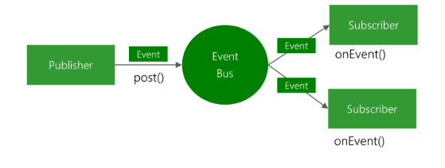

# EventBus 介绍
官方给EvenBus的描述是:
>EventBus is a publish/subscribe event bus optimized for Android.

意思就是EventBus 是Android上一个发布/订阅 的 事件总线最佳实现.

<!-- more -->

大致工作原理如下:
(图片来自:https://github.com/greenrobot/EventBus)



大致流程就是有发布者(Publisher,一般在项目中发布者是Actiivty,Fragment等等..)通过调用post方法将Event传递给EventBus,然后由EventBus将Event传递给对应的订阅者(Subscriber,就是调用订阅者的onEvent方法,一般在项目中订阅者也是Activity,Fragment等等..)

# EventBus 的 一般使用方法

1.创建Event 类

``` java

public static class MessageEvent { /* Additional fields if needed */ }

```

2.在订阅者类中声明 接收Event的方法

``` java

@Subscribe(threadMode = ThreadMode.MAIN)  
public void onMessageEvent(MessageEvent event) {/* Do something */};


//把EventBus 和 Activity/Fragment 的生命周期绑定
@Override
public void onStart() {
    super.onStart();
    EventBus.getDefault().register(this);
}

@Override
public void onStop() {
    super.onStop();
    EventBus.getDefault().unregister(this);
}

```

3.发布事件

``` java

EventBus.getDefault().post(new MessageEvent());

```


# 源码分析
Talk is cheap,Show me the code.

## Register 方法
``` java
    
    //首先从EventBus 的 Register方法入手
    //代码目录: EventBus.java
    public void register(Object subscriber) {
        //获取subscriber 的class
        Class<?> subscriberClass = subscriber.getClass();
        //通过 subscriberMethodFinder 去 寻找 subscriber 中的所有 subscriberMethod 即 用来接收 Event 的方法
        List<SubscriberMethod> subscriberMethods = subscriberMethodFinder.findSubscriberMethods(subscriberClass);
        synchronized (this) {

            for (SubscriberMethod subscriberMethod : subscriberMethods) {
                //调用 subscribe 方法  后面详细分析
                subscribe(subscriber, subscriberMethod);
            }
        }
    }


    //代码目录 SubscriberMethodFinder
    List<SubscriberMethod> findSubscriberMethods(Class<?> subscriberClass) {
        // METHOD_CACHE 本质是一个Map<Class<?>, List<SubscriberMethod>>
        // 主要用于缓存SubscriberMethod .
        List<SubscriberMethod> subscriberMethods = METHOD_CACHE.get(subscriberClass);
        //判断是否有缓存
        if (subscriberMethods != null) {
            return subscriberMethods;
        }

        //这个boolean 值默认是false 
        if (ignoreGeneratedIndex) {
            subscriberMethods = findUsingReflection(subscriberClass);
        } else {
            //默认会执行这里
            subscriberMethods = findUsingInfo(subscriberClass);
        }
        //如果通过上面的寻找  返回的依然是空  那么就会报错
        //所以的出结论. 使用Register 的方法 如果不声明接收事件的方法 会报错
        if (subscriberMethods.isEmpty()) {
            throw new EventBusException("Subscriber " + subscriberClass
                    + " and its super classes have no public methods with the @Subscribe annotation");
        } else {
            //将获取到的 List<SubscriberMethod> 存入缓存,方便复用
            METHOD_CACHE.put(subscriberClass, subscriberMethods);
            return subscriberMethods;
        }
    }


    //代码目录同上
    private List<SubscriberMethod> findUsingInfo(Class<?> subscriberClass) {
        FindState findState = prepareFindState();
        findState.initForSubscriber(subscriberClass);
        while (findState.clazz != null) {
            findState.subscriberInfo = getSubscriberInfo(findState);
            if (findState.subscriberInfo != null) {
                SubscriberMethod[] array = findState.subscriberInfo.getSubscriberMethods();
                for (SubscriberMethod subscriberMethod : array) {
                    if (findState.checkAdd(subscriberMethod.method, subscriberMethod.eventType)) {
                        findState.subscriberMethods.add(subscriberMethod);
                    }
                }
            } else {
                //默认第一次 会走这里
                findUsingReflectionInSingleClass(findState);
            }
            findState.moveToSuperclass();
        }
        return getMethodsAndRelease(findState);
    }

    //代码目录同上
    private void findUsingReflectionInSingleClass(FindState findState) {
        Method[] methods;
        try {
            // This is faster than getMethods, especially when subscribers are fat classes like Activities
            //小技巧:上面的注释说在acitivty 或 fragment 中使用getDeclaredMethods()方法比getMethods()方法效率要高
            //这就是为什么我们在Activity或者Fragment 中声明接收消息的方法的时候要用Public来修饰的原因,是用public来修饰可以提升效率
            methods = findState.clazz.getDeclaredMethods();
        } catch (Throwable th) {
            // Workaround for java.lang.NoClassDefFoundError, see https://github.com/greenrobot/EventBus/issues/149
            methods = findState.clazz.getMethods();
            findState.skipSuperClasses = true;
        }
        //循环遍历所有方法, 查找是否有满足接收Event的方法,如果有就封装成SubscriberMethod对象并添加到FindeState的subscriberMethods中.
        for (Method method : methods) {
            int modifiers = method.getModifiers();
            //接收Event的放的修饰符必须是Public且不准是static,abstract.
            if ((modifiers & Modifier.PUBLIC) != 0 && (modifiers & MODIFIERS_IGNORE) == 0) {
                Class<?>[] parameterTypes = method.getParameterTypes();
                //接收Event的方法的参数必须是1位
                if (parameterTypes.length == 1) {
                    Subscribe subscribeAnnotation = method.getAnnotation(Subscribe.class);
                    if (subscribeAnnotation != null) {
                        Class<?> eventType = parameterTypes[0];
                        if (findState.checkAdd(method, eventType)) {
                            ThreadMode threadMode = subscribeAnnotation.threadMode();
                            //添加SubscriberMethod 对象到findState中
                            findState.subscriberMethods.add(new SubscriberMethod(method, eventType, threadMode,
                                    subscribeAnnotation.priority(), subscribeAnnotation.sticky()));
                        }
                    }
                } else if (strictMethodVerification && method.isAnnotationPresent(Subscribe.class)) {
                    String methodName = method.getDeclaringClass().getName() + "." + method.getName();
                    throw new EventBusException("@Subscribe method " + methodName +
                            "must have exactly 1 parameter but has " + parameterTypes.length);
                }
            } else if (strictMethodVerification && method.isAnnotationPresent(Subscribe.class)) {
                String methodName = method.getDeclaringClass().getName() + "." + method.getName();
                throw new EventBusException(methodName +
                        " is a illegal @Subscribe method: must be public, non-static, and non-abstract");
            }
        }
    }

    //代码目录 EventBus.java
    //在上面的Register方法中,获取到了List<SubscriberMethod>对象,然后巡回遍历集合,调用subscribe方法.
    private void subscribe(Object subscriber, SubscriberMethod subscriberMethod) {
        Class<?> eventType = subscriberMethod.eventType;
        //通过SubscriberMethod(接收Event的方法封装的对象) 和 Subscriber(订阅者对象)创建Subscription对象.
        //subscriptionsByEventType 这个Map 是用来表示 Subscriptions 和 EventType的关系的,可以通过EventType 获取到 Subsciption对象
        Subscription newSubscription = new Subscription(subscriber, subscriberMethod);
        CopyOnWriteArrayList<Subscription> subscriptions = subscriptionsByEventType.get(eventType);
        if (subscriptions == null) {
            subscriptions = new CopyOnWriteArrayList<>();
            subscriptionsByEventType.put(eventType, subscriptions);
        } else {
            //不能重复调用register方法,不然会抛出下面的异常
            if (subscriptions.contains(newSubscription)) {
                throw new EventBusException("Subscriber " + subscriber.getClass() + " already registered to event "
                        + eventType);
            }
        }

        //这个时候 subscriptions 集合 的size 是 0
        int size = subscriptions.size();
        for (int i = 0; i <= size; i++) {
            if (i == size || subscriberMethod.priority > subscriptions.get(i).subscriberMethod.priority) {
                //添加Subscrption 到 集合中
                subscriptions.add(i, newSubscription);
                break;
            }
        }

        //typesBySubscriber 主要用来存储  Subscriber 和 SubscribedEvents 之间的对应关系,可以通过Key(Subscriber)获取到 对应的 SubscribedEvents对象.
        List<Class<?>> subscribedEvents = typesBySubscriber.get(subscriber);
        if (subscribedEvents == null) {
            subscribedEvents = new ArrayList<>();
            typesBySubscriber.put(subscriber, subscribedEvents);
        }
        subscribedEvents.add(eventType);

        //此处若不是用sticky 就直接指向完了
        if (subscriberMethod.sticky) {
            if (eventInheritance) {
                // Existing sticky events of all subclasses of eventType have to be considered.
                // Note: Iterating over all events may be inefficient with lots of sticky events,
                // thus data structure should be changed to allow a more efficient lookup
                // (e.g. an additional map storing sub classes of super classes: Class -> List<Class>).
                Set<Map.Entry<Class<?>, Object>> entries = stickyEvents.entrySet();
                for (Map.Entry<Class<?>, Object> entry : entries) {
                    Class<?> candidateEventType = entry.getKey();
                    if (eventType.isAssignableFrom(candidateEventType)) {
                        Object stickyEvent = entry.getValue();
                        checkPostStickyEventToSubscription(newSubscription, stickyEvent);
                    }
                }
            } else {
                Object stickyEvent = stickyEvents.get(eventType);
                checkPostStickyEventToSubscription(newSubscription, stickyEvent);
            }
        }
    }


```


>到这里EventBus的Register方法大致的执行流程分析完了,大致总结一下,首先通过传入的subscriber对象,反射获取方法,并抽取出有注解的方法并封装成SubscriberMethod对象,然后在将SubscriberMethod对象和EventType存入subscriptionsByEventType,把subscriber对象和SubscribedEvent对象存入typesBySubscriber Map中.

大概出现了下面这几个角色:

1. subscriptionsByEventType Map: K:EventType V:CopyOnWriteArrayList<Subscription>
2. Subscription : subscriber和subscriberMethod
3. typesBySubscriber Map: K:subscriber V:List<EventType>
4. EventTyoe : Class<?>
5. subscriber : 订阅者对象(一般是Activity或者Fragment)
6. subscriberMethod : 用来接收Event方法封装的对象

**在Register方法执行的过程中对大部分对象都做了缓存的操作,这就证明了EventBus对性能的影响微乎其微.**

## post方法

``` java
    //在发布事件的时候 是直接调用post方法
    //代码目录EventBus.java
    public void post(Object event) {
        //这里是一个ThreadLoacl,具体可以去Google,具体的作用是为每个Thread保存数据
        PostingThreadState postingState = currentPostingThreadState.get();
        List<Object> eventQueue = postingState.eventQueue;
        eventQueue.add(event);

        if (!postingState.isPosting) {
            //判断当前调用Post方法的线程 是否是主线程
            postingState.isMainThread = Looper.getMainLooper() == Looper.myLooper();
            postingState.isPosting = true;
            if (postingState.canceled) {
                throw new EventBusException("Internal error. Abort state was not reset");
            }
            try {
                while (!eventQueue.isEmpty()) {
                    postSingleEvent(eventQueue.remove(0), postingState);
                }
            } finally {
                postingState.isPosting = false;
                postingState.isMainThread = false;
            }
        }
    }

    //代码目录 同上
    private void postSingleEvent(Object event, PostingThreadState postingState) throws Error {
        //获取Event的类型 即发布事件的类型
        Class<?> eventClass = event.getClass();
        boolean subscriptionFound = false;
        if (eventInheritance) {
            //获取当前是否有缓存EventType
            List<Class<?>> eventTypes = lookupAllEventTypes(eventClass);
            int countTypes = eventTypes.size();
            for (int h = 0; h < countTypes; h++) {
                Class<?> clazz = eventTypes.get(h);
                //通过lookupAllEventTypes 方法获取所以EventType 并循环发送事件
                subscriptionFound |= postSingleEventForEventType(event, postingState, clazz);
            }
        } else {
            subscriptionFound = postSingleEventForEventType(event, postingState, eventClass);
        }
        if (!subscriptionFound) {
            if (logNoSubscriberMessages) {
                Log.d(TAG, "No subscribers registered for event " + eventClass);
            }
            if (sendNoSubscriberEvent && eventClass != NoSubscriberEvent.class &&
                    eventClass != SubscriberExceptionEvent.class) {
                post(new NoSubscriberEvent(this, event));
            }
        }
    }

    //代码目录同上  此方法主要是将EventType 添加到eventTypes 这个集合中 并返回,
    //而这里会循环遍历 所有父类类型, 每个类型 都是一个EventType 
    //打个比方:首先新建MessageEvent 消息Event 父类, 然后在创建一个ImageMessageEvent 图片消息类,这是如果发布ImagemessageEvent类型的事件,那么注册的Event类型为MessageEvent 也会收到。
    private static List<Class<?>> lookupAllEventTypes(Class<?> eventClass) {
        synchronized (eventTypesCache) {
            //从缓存中获取EventType集合
            List<Class<?>> eventTypes = eventTypesCache.get(eventClass);
            if (eventTypes == null) {
                eventTypes = new ArrayList<>();
                Class<?> clazz = eventClass;
                while (clazz != null) {
                    eventTypes.add(clazz);
                    addInterfaces(eventTypes, clazz.getInterfaces());
                    clazz = clazz.getSuperclass();
                }
                eventTypesCache.put(eventClass, eventTypes);
            }
            return eventTypes;
        }
    }


    //代码目录同上
    private boolean postSingleEventForEventType(Object event, PostingThreadState postingState, Class<?> eventClass) {
        CopyOnWriteArrayList<Subscription> subscriptions;
        synchronized (this) {
            //subscriptionByEventType 这个map是在Register方法中初始化的
            //可以通过EventType 获取对应的所有的Subscriptions
            subscriptions = subscriptionsByEventType.get(eventClass);
        }
        //循环Subscriptions 集合 并调用postToSubscription方法发送事件
        //事件发送完毕之后,将postingState对象的状态清空
        //由此发现,其实postingState 是用来记录发送事件的状态信息的
        //因为发送一个事件可能在主线程,也可能在子线程,所以这里的postingState是ThreadLocal类型,ThreadLocal就是用来在每个线程中分别存储不同的对象,在多线程中互不干扰.
        if (subscriptions != null && !subscriptions.isEmpty()) {
            for (Subscription subscription : subscriptions) {
                postingState.event = event;
                postingState.subscription = subscription;
                boolean aborted = false;
                try {
                    postToSubscription(subscription, event, postingState.isMainThread);
                    aborted = postingState.canceled;
                } finally {
                    postingState.event = null;
                    postingState.subscription = null;
                    postingState.canceled = false;
                }
                if (aborted) {
                    break;
                }
            }
            return true;
        }
        return false;
    }

    //代码目录同上, 此方法主要是通过@Subscribe注解中声明的ThreadMode,来通过不同的方式调用事件接收方法
    private void postToSubscription(Subscription subscription, Object event, boolean isMainThread) {
        switch (subscription.subscriberMethod.threadMode) {
            //在调用post方法的线程中调用接收事件的方法
            case POSTING:
                invokeSubscriber(subscription, event);
                break;
            //在主线程(UI线程)中调用接收事件的方法
            case MAIN:
                //当前是否在子线程中
                if (isMainThread) {
                    invokeSubscriber(subscription, event);
                } else {
                    mainThreadPoster.enqueue(subscription, event);
                }
                break;
            //在子线程中执行,如果当前线程是子线程,就在当前线程中执行
            case BACKGROUND:
                if (isMainThread) {
                    backgroundPoster.enqueue(subscription, event);
                } else {
                    invokeSubscriber(subscription, event);
                }
                break;
            //重新开启一个线程执行
            case ASYNC:
                asyncPoster.enqueue(subscription, event);
                break;
            default:
                throw new IllegalStateException("Unknown thread mode: " + subscription.subscriberMethod.threadMode);
        }
    }

    //在当前线程中执行onEventMessage方法
    void invokeSubscriber(Subscription subscription, Object event) {
        try {
            //最简单的反射调用 将事件做为参数传入
            subscription.subscriberMethod.method.invoke(subscription.subscriber, event);
        } catch (InvocationTargetException e) {
            handleSubscriberException(subscription, event, e.getCause());
        } catch (IllegalAccessException e) {
            throw new IllegalStateException("Unexpected exception", e);
        }
    }

```

>上面就是整个post的过程,当然里面还有很多复杂的处理,但是还是会通过反射调用方法,通过上面的代码,整个post的过程大概分为下面几步.

1. EventBus 使用ThreadLocal 来为每个调用Post方法的线程存储PostingThreadState对象.
2. 通过循环将EventType 以及 EventType的父类添加到EventTypes 集合中
3. 通过获取每个EventType,在subscriptionsByEventType Map中获取Subscriptions对象
4. 根据不同的ThreadMode,通过反射,循环执行Subscriptions 中的subscriberMethod.Method

post方法大致就这么几步.


## unRegister 方法

``` java

    //代码目录 EventBus.java  此方法主要是做一些解绑的操作,多在onDestory或者onStop中调用.
    public synchronized void unregister(Object subscriber) {
        //从typesBySubscriber map中通过subscriber 获取 SubscribedTypes
        //里面存储的是当前类在EventBus中注册接收Event方法的EventType集合
        List<Class<?>> subscribedTypes = typesBySubscriber.get(subscriber);
        if (subscribedTypes != null) {
            for (Class<?> eventType : subscribedTypes) {
                //循环从
                unsubscribeByEventType(subscriber, eventType);
            }
            typesBySubscriber.remove(subscriber);
        } else {
            Log.w(TAG, "Subscriber to unregister was not registered before: " + subscriber.getClass());
        }
    }

    //代码目录同上 主要负责subscriptionsByEventType 的移除操作
    private void unsubscribeByEventType(Object subscriber, Class<?> eventType) {
        List<Subscription> subscriptions = subscriptionsByEventType.get(eventType);
        if (subscriptions != null) {
            int size = subscriptions.size();
            for (int i = 0; i < size; i++) {
                Subscription subscription = subscriptions.get(i);
                if (subscription.subscriber == subscriber) {
                    subscription.active = false;
                    subscriptions.remove(i);
                    //移除一个Subscriptions 就向前移一位,大多数情况下一个类中只一个类型的接收Event的方法只有一个.
                    i--;
                    size--;
                }
            }
        }
    }

```

>unRegister 相对简单,只是从map中将相应的数据移除

1. 移除 subscriptionsByEventType 中的subscription
2. 移除 typesBySubscriber 中的 type


# 总结
EventBus 的一般的执行流程差不多就上面这些.大致就是register()->post()->unRegister()

1. Register方法主要用来将接受事件的方法封装成对象保存在Map中
2. Post方法主要用来发布事件,循环Map,找对对应Event类型的Subscription并通过反射执行对应的方法
3. UnRegister方法主要是解除订阅者和EventBus的关系,本质就是从Map中移除对象.
