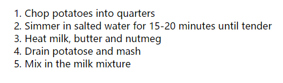
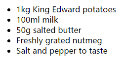
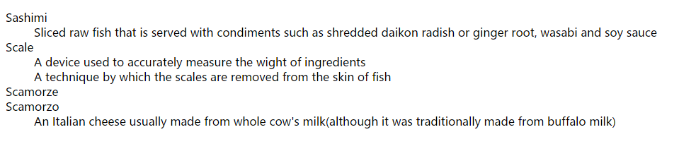

# HTML列表标签
在很多场合都需要用到列表,HTML提供了三种不同的列表
1. 有序列表是指为其中的每个项目编号的列表.例如,有序列表可能是菜谱的一系列步骤,而这些步骤必须按照顺序完成,也可能是一则法律合同,合同中的每项条文都需要指定一个序号.
2. 无序列表是指以点状项目符号(不同于表明顺序的字符)作为开头的列表.
3. 定义列表是由一系列术语及其定义组成的列表.

<!-- more -->

## 有序列表
``<ol><li>``

``` html

<!DOCTYPE html>
<html>
<head>
    <title></title>
</head>
<body>

<ol>
    <li>Chop potatoes into quarters</li>
    <li>Simmer in salted water for 15-20 minutes until tender</li>
    <li>Heat milk, butter and nutmeg</li>
    <li>Drain potatose and mash</li>
    <li>Mix in the milk mixture</li>
</ol>

</body>
</html>

```

效果图:<br />


标签用法:使用``<ol>``原元素来创建有序列表.列表中的每个Item都被置于起始标签``<li>``和结束标签``</li>``之间,浏览器默认对列表进行缩进.

## 无序列表
``<ul><li>``

``` html

<!DOCTYPE html>
<html>
<head>
    <title></title>
</head>
<body>

<ul>
    <li>1kg King Edward potatoes</li>
    <li>100ml milk</li>
    <li>50g salted butter</li>
    <li>Freshly grated nutmeg</li>
    <li>Salt and pepper to taste</li>
</ul>

</body>
</html>

```

效果图:<br />


标签用法:使用``<ul>``元素来创建无序列表,列表中每个Item都被置于起始标签``<li>``和结束标签``</li>``之间,浏览器默认对列表进行缩进.

## 定义列表
``<dl><dt><dd>``

``` html

<!DOCTYPE html>
<html>
<head>
    <title></title>
</head>
<body>

<dl>
    <dt>Sashimi</dt>
    <dd>Sliced raw fish that is served with condiments such as shredded daikon radish or ginger root, wasabi and soy sauce</dd>
    <dt>Scale</dt>
    <dd>A device used to accurately measure the wight of ingredients</dd>
    <dd>A technique by which the scales are removed from the skin of fish</dd>
    <dt>Scamorze</dt>
    <dt>Scamorzo</dt>
    <dd>An Italian cheese usually made from whole cow's milk(although it was traditionally made from buffalo milk)</dd>
</dl>

</body>
</html>

```

效果图:<br />


标签用法:定义列表由``<dl>``元素创建,并且通常包含一系列术语及其定义.在``<dl>``元素内部,经常能看到成对的``<dt>``和``<dd>``元素.``<dt>``元素用来包含被定义的术语.``<dd>``元素用来包含定义.有时可能会看到连个术语拥有同样的定义.或者是两个不同的定义解释同一个术语.

## 嵌套列表

``` html

<!DOCTYPE html>
<html>
<head>
    <title></title>
</head>
<body>

<ul>
    <li>Mousses</li>
    <li>Pastries
        <ul>
            <li>Croissant</li>
            <li>Mille-feuille</li>
            <li>Palmier</li>
            <li>Profiterole</li>
        </ul>
    </li>
    <li>Tarts</li>
</ul>

</body>
</html>

```

效果图:<br />


可以在``<li>``元素中放入另一个列表来创建子列表,或者叫嵌套列表.浏览器对嵌套列表的缩进比它的父级列表更深.在嵌套的无序列表,浏览器通常也会改变Item符号的样式.

# Sample

``` html

<!DOCTYPE html>
<html>
<head>
    <title></title>
</head>
<body>

<h1>Scambled Eggs</h1>
<p>Eggs are one of my favourite foods. Here is a recipe for deliciously rich scarambled eggs.</p>
<h2>Ingredients</h2>
<ul>
    <li>2 eggs</li>
    <li>1tbs butter</li>
    <li>2tbs cream</li>
</ul>
<h2>Method</h2>
<ol>
    <li>Melt butter in a frying pan over a medium heat</li>
    <li>Gently mix the eggs and cream in a bowl</li>
    <li>Once butter has melted add cream and eggs</li>
    <li>Using a spatula fold the eggs from the edge of the pan to the center every 20 seconds (as if you are making an omelette)</li>
    <li>When the egs are still moist remove from the heat (it will continue to cook on the plate until served)</li>
</ol>

</body>
</html>

```

效果图:<br />


# 总结
1. HTML中有三种列表:有序列表,无序列表和定义列表.
2. 有序列表使用数字编号.
3. 无序列表使用项目符号.
4. 定义猎列表用来定义专业属于.
5. 列表可以嵌套在其他列表中.