# HTML文本标签
文本标签 主要用来给显示在网页上的文本添加标记,主要分为结构化标记 和 语义化标记.

<!-- more -->

结构化标记: **可用来描述标题和段落的元素**

语义化标记: **用来表达特定含义的标记.例如在一个句子中的什么位置加入强调内容,也可以表明是一个引用(以及引用的作者),或者表明是一个缩写词的全称等等.**

# 结构化标记

## 标题标签
``<h1>``

``` html

<!DOCTYPE html>
<html>
<head>
    <title></title>
</head>
<body>

<h1>This is a Main Heading</h1>
<h2>This is a Level 2 Heading</h2>
<h3>This is a Level 3 Heading</h3>
<h4>This is a Level 4 Heading</h4>
<h5>This is a Level 5 Heading</h5>
<h6>This is a Level 6 Heading</h6>

</body>
</html>

```

效果图:<br />
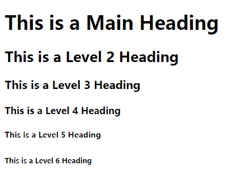

标签用法:HTML中的标题有6个级别``<h1>``用在组主标题上,如果在子标题下还有分段,就可以使用元素``<h3>``,以此类推.
浏览器使用不同的字号显示这些标题中的内容.``<h1>``元素中内容的字号最大,``<h6>``元素中内容的字号最小,每种浏览器显示标题的具体大小会略有不同.

## 段落标签
``<p>``

``` html
<!DOCTYPE html>
<html>
<head>
    <title></title>
</head>
<body>

<p>A paragraph consists of one or more sentences that form a self-contained 
unit of discourse. The start of a paragraph is indicated by a new line.</p>

<p>Text is easier to understand when it is split up into units of text. For
 example, a book may have chapters。 Chapters can have subheadings. Under each
 heading there will be one or more paragraphs.</p>

</body>
</html>
```

效果图:<br />
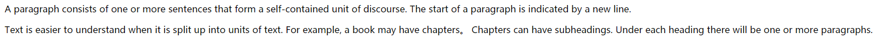

标签用法:在成端的文字两端分别添加起始标签``<p>``和结束标签``</p>``就能构成HTML中所指的段落。默认情况下,浏览器在显示段落时会另起一行并与后续段落保持一定的距离。

## 粗体
``<b>``

``` html
<!DOCTYPE html>
<html>
<head>
    <title></title>
</head>
<body>

<p>This is how we make a word appear <b>bold.</b></p>
<p>Inside a product description you might see some <b>key features</b> in bold.</p>

</body>
</html>
```

效果图:<br />
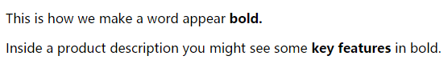

标签用法:通过将文字包含在``<b>和</b>``之间,就可以实现在某段文字中将一段字显示为粗体.

## 斜体
``<i>``

``` html

<!DOCTYPE html>
<html>
<head>
    <title></title>
</head>
<body>

<p>This is how we make a word appear
<i>italic</i>.
</p>

<p>It's a potato <i>Solanum teberosum</i>.</p>
<p>Captain Cook sailed to Australia on the <i>Endeavour</i>.</p>

</body>
</html>

```


效果图:<br />
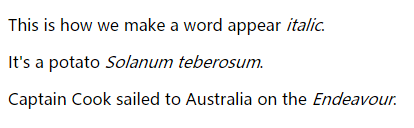

标签用法:通过将文字包含在``<i>和</i>``之间,就可以实现在某段文字中将一段字显示为斜体.

## 上标和下标 
``<sup> <sub>``

``` html

<!DOCTYPE html>
<html>
<head>
    <title></title>
</head>
<body>

<p>One the <sup>th</sup> of September you will learn about E=MC<sup>2</sup>.</p>
<p>The amount of CO<sub>2</sub> in the atmosphere grew by 2ppm in 2009<sub>1</sub>.</p>

</body>
</html>

```

效果图:<br />
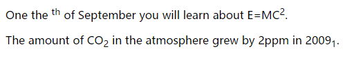

标签用法:``<sup>``用来标记作为上标的字符,例如日期后缀.``<sub>``元素用来标记做为下标的字符。

## 空白
White-Space

``` html

<!DOCTYPE html>
<html>
<head>
    <title></title>
</head>
<body>

<p>The moon is drifting away from Earth.</p>
<p>The moon         is drifting away from Earth.</p>
<p>The moon is drifting away from      

    Earth.</p>

</body>
</html>

```

效果图:<br />
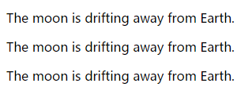

为了增加代码的可读性,设计人员经常通过补充空格或者换行的方式来编写代码.当浏览器遇到两个或两个以上的空格的时候,只将会显示一个空格.同样,当遇到一次换行的时候,浏览器也会将其看作一个空格.这一特性成为 **白色空间折叠**.经常会看到网页设计人员利用白色空间折叠来缩进他们的代码,以保证代码具有更好的可读性.

## 换行符
``<br />``

``` html

<!DOCTYPE html>
<html>
<head>
    <title></title>
</head>
<body>

<p>The Earth <br />gets one hundred tonsheavier
    every day<br />due to falling space dust.</p>

</body>
</html>

```

效果图:<br />
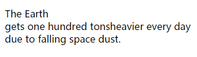

标签用法:浏览器在显示另一个段落或者标题的时候会自动换行.但如果想在段落中的某个位置加入换行符,可以使用``<br />``标签.

## 水平线
``<hr />``

``` html

<!DOCTYPE html>
<html>
<head>
    <title></title>
</head>
<body>

<p>The Earth <br />Venus is the only planet that rotates clockwise.</p>
<hr />
<p>Jupiter is bigger than all the other planets combined.</p>

</body>
</html>

```

效果图:<br />
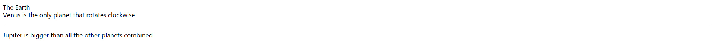

标签用法:在不同的主题间进行分割时,可以使用``<hr />``标签来插入一条水平线,有一小部分元素,其起始标签和结束标签间不含任何文字,这些元素被称为空元素,并且它们的书写也有所不同.一个空元素通常只包含有一个标签,在空元素的闭合尖括号前,经常是一个空格和一个斜线.尽管有的网页设计人员会忽略这个空格和斜线，但在编写代码时加上它们是一个好习惯.

# 语义化标记
有一些文本元素,它们不影响网页结构,却为所在页面添加了额外信息- 这些元素称为语义化标记

## 加粗
``<strong>``

``` html

<!DOCTYPE html>
<html>
<head>
    <title></title>
</head>
<body>

<p><strong>Beware:</strong>Pickpockets operate in this area.</p>
<p>This toy has many small pieces and is <strong>not suitable for children underfive years old.</strong></p>

</body>
</html>

```

效果图:<br />
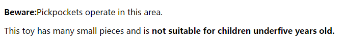

标签用法:``<strong>``元素的作用是表示其中的内容十分重要.例如阅读其中的文章的时候需要加重语气.默认情况下``<strong>``元素中的内容在浏览器中显示为粗体

## 强调 
``<em>``

``` html

<!DOCTYPE html>
<html>
<head>
    <title></title>
</head>
<body>

<p>I <em>think</em> Ivy was the first.</p>
<p>I think <em>Ivy</em> was the first.</p>
<p>I think Ivy was the <em>first</em>.</p>

</body>
</html>

```

效果图:<br />
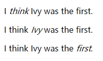

标签用法:``<em>``元素起强调作用,能够细微改变语句的含义,默认情况下,``<em>``元素中的内容在浏览器中显示为斜体.

## 引用
``<blockquote> <q>``

``` html

<!DOCTYPE html>
<html>
<head>
    <title></title>
</head>
<body>

<blockquote cite="http://baidu.com"><p>Did you ever stop to think, and forget to start again?</p></blockquote>
<p>As A.A. Milne said, <q>Some people talk to animals. Not many listen though. That's the problem.</q></p>

</body>
</html>

```

效果图:<br />
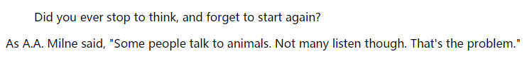

标签用法:``<blockquote>``元素用来标记那些会占用一整段的较长的引用.注意这里的``<p>``元素也被包含在``<blockquote>``,浏览器通常会对``<blockquote>``元素中的内容进行缩放,``<q>``元素用来标记位于段落中的短引用,按照惯例,流浪器理应在``<q>``元素的两侧添加引号,可是IE浏览器却不支持.这两个元素都可以用cite特性来表明应用的来源,cite特性的值应当是一个URL,该URL中包括有关引用来源的更详细信息.

## 缩写词和首写字母缩写词 `
``<abbr>``

``` html

<!DOCTYPE html>
<html>
<head>
    <title></title>
</head>
<body>

<p><abbr title="Professor">Prof </abbr>Stephen Hawking is a theoretical physicist and cosmologist.</p>
<p><acronym title="National Aeronautics and Space Adinistration">NASA </acronym>do some crazy space stuff.</p>

</body>
</html>

```

效果图:<br />
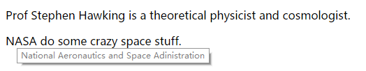

标签用法:如果你要使用缩写词或是首字母缩写词,那么``<abbr>``可以派上用场.其起始标签中的title特性用来指定相应词汇的完整形式,在HTML4中,对于首字母缩写词专门有一个``<acronym>``元素,与上面的``<abbr>``一样,``<acrony>``元素也采用title特性来拼写出相应词汇的完整形式,HTML5中,不论缩写词还是首字母缩写词都用``<abbr>``元素.

## 引文
``<cite>``

``` html

<!DOCTYPE html>
<html>
<head>
    <title></title>
</head>
<body>

<p><cite>A Brief History of Time </cite>by Stephen Hawking has sold over ten millioncopies worldwide.</p>

</body>
</html>

```

效果图:<br />
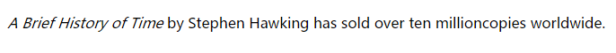

标签用法:当引用一部作品时(可以是书籍,电影,或研究报告等..),``<cite>``元素可以用来表明引用的来源.在HTMl5中``<cite>``元素不可用在人名上,但在HTML4中是可以的,所以很多人还是喜欢继续这样使用.浏览器会把``<cite>``元素中的内容显示为斜体.

## 定义
``<dfn>``

``` html

<!DOCTYPE html>
<html>
<head>
    <title></title>
</head>
<body>

<p>A <dfn>black hole</dfn> is a region of space from which nothing, not even light, can escape.</p>

</body>
</html>

```

效果图:<br />
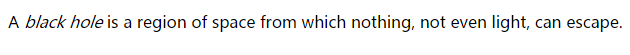

标签用法:当解释一些新术语时,会给出它的定义,``<dfn>``元素用来表示一个新术语的定义.有些浏览器使用斜体来显示``<dfn>``中的内容,Safari和Chrome浏览器则不会改变其外观.

## 设计者详细信息 
``<address>``

``` html

<!DOCTYPE html>
<html>
<head>
    <title></title>
</head>
<body>

<address>
    <p><a href="http://www.baidu.com">www.baidu.com</a></p>
    <p>742 Evergreen Terrace, Springfield.</p>
</address>

</body>
</html>

```

效果图:<br />
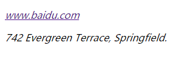

标签用法:``<address>``元素有一个非常特殊的用途:包含页面设计者的联系方式.它可以包含一个物理地址,但并非是必须,例如,他可能包含一个电话号码或电子邮箱地址.浏览器通常将``<address>``元素中的内容显示为斜体.

## 内容的修改  
``<del><ins><s>``

``` html

<!DOCTYPE html>
<html>
<head>
    <title></title>
</head>
<body>

<p>It was the <del>worst</del> <ins>best</ins> idea she had ever had.</p>

</body>
</html>

```

``` html

<!DOCTYPE html>
<html>
<head>
    <title></title>
</head>
<body>

<p>Laptop computer:</p>
<p><s>Was $995</s></p>
<p>Now only $375</p>

</body>
</html>

```

效果图:<br />
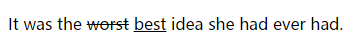

效果图:<br />
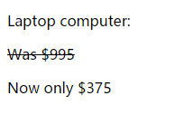

标签用法:``<ins>``元素用来显示已经插入到文档中的内容,而``<del>``元素则用来显示已经从文档中删除的文本.``<del>``元素中的内容通常带有下划线,``<del>``中的内容则带有删除线.``<s>``元素表示不准确或不相关却并不应当予以删除的内容.从外观上看,``<s>``元素的内容通常带有从中穿过的线条.旧版本HTML中有一个``<u>``元素表示带有下划线的内容,但这个元素已经逐渐被淘汰.

## Sample 

``` html

<!DOCTYPE html>
<html>
<head>
    <title></title>
</head>
<body>

<h1>The Story in the Book</h1>
<h2>Chapter 1</h2>
<p>Molly had been staring out of her window for about an hour now.
On her desk, lying between the copies of<i>Nature</i>, <i>New Scientist</i>, 
and all the other scientific journals her work had appeared in , was a well 
thumbed copy of
<cite>On The Road</cite>. It had been Molly's favorite book since college, and 
the longer she spent in these four walls the more she felt she needed to be 
free.</p>
<p>She had spent the last ten years in this room, sitting under a poster with 
an Oscar Wilde quote proclaiming that<q>Work is the refuge of people who have 
nothin better to do</q>.
Although many considered her pioneering work, unraveling the secrets of the 
11ama <abbr title="Deoxyribonucleicacid">DNA</abbr>, to be an outstanding 
achievement, Molly <em>did</em> think she had something better to do .</p>

</body>
</html>

```

效果图:<br />
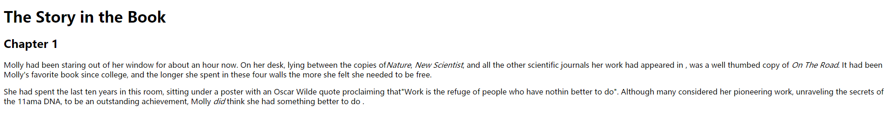

# 总结
1. HTML元素用来描述页面中的结构(例如标题,子标题和段落)
2. HTML元素还提供语义信息(例如在上面位置着重强调,所使用的缩略预定义,给定的文本何时是一个引用).