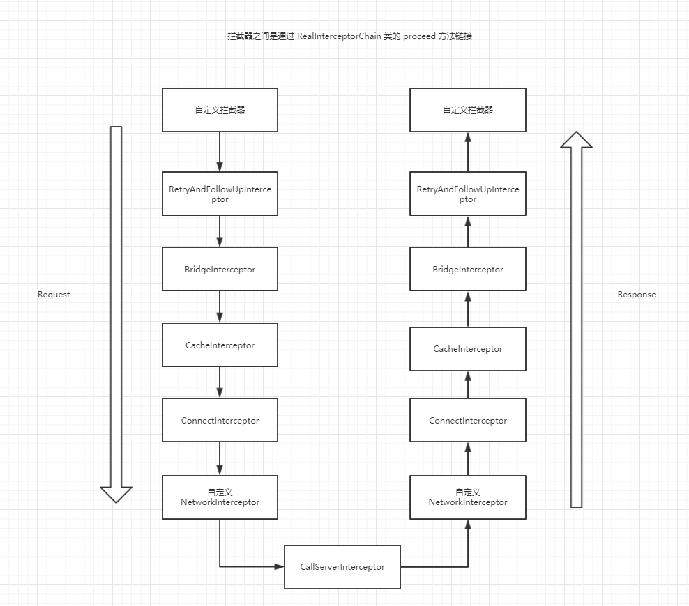

# 开始

又是新的一周，美好的一周，应该由源码解析来开始。很早就像看看OkHttp的源码，主要是对这个框架中的 Interceptor(拦截器) 比较感兴趣，废话少说，跟随源码的脚步来看看它的实现原理吧~

<!-- more -->

# 分析

## OkHttp 的使用方法

看源码的第一步肯定要先会使用，那么OkHttp的一般使用方法很简单，代码如下:

``` java

OkHttpClient okHttpClient = new OkHttpClient();
Request request = new Request.Builder()
        .url("http://gank.io/api/data/Android/10/1")
        .build();
okHttpClient.newCall(request).enqueue(new Callback() {
    @Override
    public void onFailure(Call call, IOException e) {
        tv_result.setText(e.getMessage());
    }

    @Override
    public void onResponse(Call call, final Response response) throws IOException {
        //此处是子线程
        //而且这个String 方法 有执行网络请求
        final String result = response.body().string();
        runOnUiThread(new Runnable() {
            @Override
            public void run() {
                tv_result.setText(result);
            }
        });
    }
});

```

更大部分网络请求框架一样，才用接口回调的方式来将结果进行返回并处理，但是需要注意的是在 onResponse  方法中是不能更新 UI 的。还有就是 onResponse 方法中的 response.body().string() 这个方法好像也有执行网络请求，因为如果在 runOnUiThread 的  run 方法中执行这行代码，会报 不能再 UI 线程中执行网络操作，具体原因我们后面慢慢分析。

## Read the fucking source code

先分析一下OkHttpClinet这个类。这个类主要负责一个OkHttp的核心配置，很显然在上面我们并没设置任何配置，所以使用的都是默认的配置。然后调用的是 OkHttpClient 的 newCall 方法，这个方法直接 new 了一个 RealCall 返回，RealCall 是实现了 Call 接口的一个类。代码如下:

``` java

@Override 
public Call newCall(Request request) {
return new RealCall(this, request, false /* for web socket */);
}

```

将 Request 对象传入 newCall() 方法，然后在调用 enqueue() 方法。enqueue 翻译过的意思是入列，这里可以推断出 OkHttp 肯定维护了一个或多个队列(废话)。代码如下:

``` java

@Override public void enqueue(Callback responseCallback) {
synchronized (this) {
  if (executed) throw new IllegalStateException("Already Executed");
  executed = true;
}
captureCallStackTrace();
client.dispatcher().enqueue(new AsyncCall(responseCallback));
}

```

可以看到，调用了 client 对象的 dispatcher 的 enqueue(),并且 new 了一个 AsyncCall 对象传入。有异步就肯定有同步，对应的方法是 execute() 方法，代码如下:

``` java

@Override 
public Response execute() throws IOException {
synchronized (this) {
  if (executed) throw new IllegalStateException("Already Executed");
  executed = true;
}
captureCallStackTrace();
try {
  client.dispatcher().executed(this);
  Response result = getResponseWithInterceptorChain();
  if (result == null) throw new IOException("Canceled");
  return result;
} finally {
  client.dispatcher().finished(this);
}
}

```

## 同步和异步

我们先分析一下 enqueue() 方法，从上面的源码中可以看出，最终会调用 dispatcher 的 enqueue 方法。代码如下:

``` java

synchronized void enqueue(AsyncCall call) {
if (runningAsyncCalls.size() < maxRequests && runningCallsForHost(call) < maxRequestsPerHost) {
  runningAsyncCalls.add(call);
  executorService().execute(call);
} else {
  readyAsyncCalls.add(call);
}
}

```

在 enqueue 方法中首先会判断当前正在执行的请求是否小于最大请求数量，然后在判断当前正在执行的请求的主机和入列请求的主机相同的个数是否小于最大主机数(maxRequestsPerHost),如果没有超出限制就将 AsyncCall 添加到 runningAsyncCalls 中，然后使用 executorService() 执行 AsyncCall。这里的 executorService 是一个线程池，execute() 方法表示从线程池中取出一个线程并执行。我们来看看线程执行了哪些代码。

``` java

@Override 
protected void execute() {
  boolean signalledCallback = false;
  try {
    //核心在这里
    Response response = getResponseWithInterceptorChain();
    if (retryAndFollowUpInterceptor.isCanceled()) {
      signalledCallback = true;
      responseCallback.onFailure(RealCall.this, new IOException("Canceled"));
    } else {
      signalledCallback = true;
      responseCallback.onResponse(RealCall.this, response);
    }
  } catch (IOException e) {
    if (signalledCallback) {
      // Do not signal the callback twice!
      Platform.get().log(INFO, "Callback failure for " + toLoggableString(), e);
    } else {
      responseCallback.onFailure(RealCall.this, e);
    }
  } finally {
    client.dispatcher().finished(this);
  }
}

```

短短20行代码，可以说是 OkHttp 的核心代码，所以我们先看大致流程，首先会通过 getResponseWithInterceptorChain() 方法获取 Response 对象，然后判断请求是否被取消，如果取消就调用 onFailure 回调。如果没有没有取消就调用 onResponse 方法。

上面我们有个问题就是在 onResponse 方法中直接更新UI 会报不能在线程中更新UI的错误。原因就在这里，这里的onResponse 方法是在子线程中被调用的，所以是不能更新UI的。

最后在 catch 中调用了 onFialure 和在 finally 中调用了 dispatcher的finished方法。enqueue() 方法的执行流程大概就上面几个步骤。OkHttp除了可以异步请求获取数据以外，还可以通过获取数据，调用 RealCall 的 execute方法，代码如下:

``` java

@Override 
public Response execute() throws IOException {
    synchronized (this) {
      if (executed) throw new IllegalStateException("Already Executed");
      executed = true;
    }
    captureCallStackTrace();
    try {
      client.dispatcher().executed(this);
      Response result = getResponseWithInterceptorChain();
      if (result == null) throw new IOException("Canceled");
      return result;
    } finally {
      client.dispatcher().finished(this);
    }
}

```

代码逻辑和 AsyncCall 中的 execute 方法差不多，不过要注意的是这里是同步的，所以如果直接在 Activity 中调用 execute 方法会报错。在上面 execute() 方法的代码中，无论是同步还是异步都在最后调用了 finish 方法，我们来看看这个方法。

``` java

void finished(AsyncCall call) {
    finished(runningAsyncCalls, call, true);
}

void finished(RealCall call) {
    finished(runningSyncCalls, call, false);
}

private <T> void finished(Deque<T> calls, T call, boolean promoteCalls) {
    int runningCallsCount;
    Runnable idleCallback;
    synchronized (this) {
      if (!calls.remove(call)) throw new AssertionError("Call wasn't in-flight!");
      if (promoteCalls) promoteCalls();
      runningCallsCount = runningCallsCount();
      idleCallback = this.idleCallback;
    }

    if (runningCallsCount == 0 && idleCallback != null) {
      idleCallback.run();
    }
}


private void promoteCalls() {
    if (runningAsyncCalls.size() >= maxRequests) return; // Already running max capacity.
    if (readyAsyncCalls.isEmpty()) return; // No ready calls to promote.

    for (Iterator<AsyncCall> i = readyAsyncCalls.iterator(); i.hasNext(); ) {
      AsyncCall call = i.next();

      if (runningCallsForHost(call) < maxRequestsPerHost) {
        i.remove();
        runningAsyncCalls.add(call);
        executorService().execute(call);
      }

      if (runningAsyncCalls.size() >= maxRequests) return; // Reached max capacity.
    }
}

```

dispatcher 中一共有三个 finished() 方法，前两个 finished() 方法调用了第三个 finished() 方法。第一个 finsihed 方法是由异步的 Call 调用的，第二个 finished() 方法是由同步的 Call 调用到的。在第三个 finished() 方法中会把 Call 对象从对应的 队列中移除.
如果当 promoteCalls 为 true 的时候会调用 promoteCalls() 方法。在这个方法中会把 readyAsyncCalls 队列中的 Call 添加到 runningAsyncCalls 中并执行。

ok，异步和同步的大致步骤差不多就上面这些，其中主要逻辑大同小异，在执行异步Call的时候，会在执行完之后把等待的 Call 全部添加到执行的队列中并执行。

一共有三个队列。

1. runningAsyncCalls (异步执行队列，每个 enqueue 的 Call 都会添加这个队列中)
2. runningSyncCalls (同步执行队列，同步任务会被添加到这个队列中)
3. readyAsyncCalls (异步等待队列，当 runningAsyncCalls 达到最大限制的时候，后续 enqueue 的 Call 会被添加到此队列中)

# 拦截器

上面仅仅只分析了大体的流程，真正执行网络请求的地方并没有看到，很显然OkHttp把最复杂的地方巧妙的隐藏起来了。重新回到 execute() 方法中的 getResponseWithInterceptorChain() 方法，代码如下:

``` java

Response getResponseWithInterceptorChain() throws IOException {
    // Build a full stack of interceptors.
    List<Interceptor> interceptors = new ArrayList<>();
    interceptors.addAll(client.interceptors());
    interceptors.add(retryAndFollowUpInterceptor);
    interceptors.add(new BridgeInterceptor(client.cookieJar()));
    interceptors.add(new CacheInterceptor(client.internalCache()));
    interceptors.add(new ConnectInterceptor(client));
    if (!forWebSocket) {
      interceptors.addAll(client.networkInterceptors());
    }
    interceptors.add(new CallServerInterceptor(forWebSocket));

    Interceptor.Chain chain = new RealInterceptorChain(
        interceptors, null, null, null, 0, originalRequest);
    return chain.proceed(originalRequest);
}

```

Interceptor 中文意识为拦截器，可以看到这个方法中有一个拦截器集合，其中系统提供了几个拦截器，每个拦截器都有自己的作用。
最后将拦截器集合传入 RealInterceptorChain 中并调用了 proceed() 方法。代码如下:

``` java

public Response proceed(Request request, StreamAllocation streamAllocation, HttpCodec httpCodec,
      RealConnection connection) throws IOException {
    if (index >= interceptors.size()) throw new AssertionError();

    calls++;

    // If we already have a stream, confirm that the incoming request will use it.
    if (this.httpCodec != null && !this.connection.supportsUrl(request.url())) {
      throw new IllegalStateException("network interceptor " + interceptors.get(index - 1)
          + " must retain the same host and port");
    }

    // If we already have a stream, confirm that this is the only call to chain.proceed().
    if (this.httpCodec != null && calls > 1) {
      throw new IllegalStateException("network interceptor " + interceptors.get(index - 1)
          + " must call proceed() exactly once");
    }

    // Call the next interceptor in the chain.
    RealInterceptorChain next = new RealInterceptorChain(
        interceptors, streamAllocation, httpCodec, connection, index + 1, request);
    Interceptor interceptor = interceptors.get(index);
    Response response = interceptor.intercept(next);

    // Confirm that the next interceptor made its required call to chain.proceed().
    if (httpCodec != null && index + 1 < interceptors.size() && next.calls != 1) {
      throw new IllegalStateException("network interceptor " + interceptor
          + " must call proceed() exactly once");
    }

    // Confirm that the intercepted response isn't null.
    if (response == null) {
      throw new NullPointerException("interceptor " + interceptor + " returned null");
    }

    return response;
  }

```


首先是一些异常处理，重点在 21 行处，又创建了一个 RealInterceptorChanin 对象，并把这个对象传入 interceptor 的 intercept() 方法中。

第一个被调用 intercept() 方法的拦截器是 RetryAndFollowUpInterceptor(前提是没有自定义拦截器，如果有自定义拦截器，OkHttp 先调用我们自定义的拦截的 intercept() 方法)。我们来看看 intercept() 方法的具体实现。代码如下:

``` java

@Override 
public Response intercept(Chain chain) throws IOException {
    Request request = chain.request();

    // 省略N多代码 .......
    response = ((RealInterceptorChain) chain).proceed(request, streamAllocation, null, null);
    // 省略N多代码 .......
}

```

代码实在有点多，我们只看重点的一行，就是在 intercept() 方法内部会调用 RealInterceptorChain 的 proceed() 方法，这个时候我们看上面的 proceed() 方法，在 new RealInterceptorChain 的时候把 index + 1 了，这个时候就会调用下一个拦截器的 intercept() 方法，代码如下:

``` java
//BridgeInterceptor.java

@Override 
public Response intercept(Chain chain) throws IOException {
    Request request = chain.request();

    // 省略N多代码 .......
    response = chain.proceed(requestBuilder.build());
    // 省略N多代码 .......
}


```

what? 这个代码不是很眼熟吗？可以看看后面的几个拦截器的 intercept 方法，在方法中都调用了 chain.proceed，有在 proceed 方法中调用下一个拦截器的 intercept 方法，如果此循环下去 就会把所有拦截器的 intercept 都调用一遍，这里有点像方法的递归调用，既然是递归，那肯定是会有一个"终点",不然这个方法就成了一个死循环，那么这里的"终点"就在最后一个拦截器的 intercept 方法中，类名叫做 CallServerInterceptor，在这类中有这样第一段注释 :

>This is the last interceptor in the chain. It makes a network call to the server.

意识就是说，这个拦截器是链中最后一个拦截器，它对服务器进行了网络调用。

到这里，整个拦截器的调用链就走完了，这里会一层一层的往上返回，调用逻辑大概是这样的:

请求：
RealInterceptorChain -> 自定义拦截器 -> RetryAndFollowUpInterceptor -> BridgeInterceptor -> CacheInterceptor -> ConnectInterceptor -> CallServerInterceptor

响应:
CallServerInterceptor -> ConnectInterceptor -> CacheInterceptor -> BridgeInterceptor -> RetryAndFollowUpInterceptor -> 自定义拦截器 -> RealInterceptorChain 

重点逻辑在各个拦截器中的 intercept() 方法中，我们可以这么理解在 intercept() 方法中 调用 proceed() 方法之前的代码是用来处理请求的，之后的代码是用来处理响应的。伪代码入下:

``` java

public Response intercept(Chain chain){
    //操作请求对象
    chain.proceed(request);
    //操作响应对象 并返回
    return Response
}

```

## Request 和 Response

上面我们分析了拦截器的调用流程，可以发现这整个流程离不开两个对象，Request 和 Response，下面来看看这两个类的具体实现.代码如下:

``` java

public final class Request {
  final HttpUrl url;
  final String method;
  final Headers headers;
  final @Nullable RequestBody body;
  final Object tag;

  private volatile CacheControl cacheControl; // Lazily initialized.

  Request(Builder builder) {
    this.url = builder.url;
    this.method = builder.method;
    this.headers = builder.headers.build();
    this.body = builder.body;
    this.tag = builder.tag != null ? builder.tag : this;
  }

  public HttpUrl url() {
    return url;
  }

  public String method() {
    return method;
  }

  public Headers headers() {
    return headers;
  }

  public String header(String name) {
    return headers.get(name);
  }

  public List<String> headers(String name) {
    return headers.values(name);
  }

  public @Nullable RequestBody body() {
    return body;
  }

  public Object tag() {
    return tag;
  }

  public Builder newBuilder() {
    return new Builder(this);
  }

  /**
   * Returns the cache control directives for this response. This is never null, even if this
   * response contains no {@code Cache-Control} header.
   */
  public CacheControl cacheControl() {
    CacheControl result = cacheControl;
    return result != null ? result : (cacheControl = CacheControl.parse(headers));
  }

  public boolean isHttps() {
    return url.isHttps();
  }

  //省略 toString 方法

  public static class Builder {
    HttpUrl url;
    String method;
    Headers.Builder headers;
    RequestBody body;
    Object tag;

    public Builder() {
      this.method = "GET";
      this.headers = new Headers.Builder();
    }

    Builder(Request request) {
      this.url = request.url;
      this.method = request.method;
      this.body = request.body;
      this.tag = request.tag;
      this.headers = request.headers.newBuilder();
    }

    public Builder url(HttpUrl url) {
      if (url == null) throw new NullPointerException("url == null");
      this.url = url;
      return this;
    }

    /**
     * 设置 Url
     */
    public Builder url(String url) {
      if (url == null) throw new NullPointerException("url == null");

      // 可以看到，如果 url 字符串是一个 WebSocket，将替换成 HTTP
      // Silently replace web socket URLs with HTTP URLs.
      if (url.regionMatches(true, 0, "ws:", 0, 3)) {
        url = "http:" + url.substring(3);
      } else if (url.regionMatches(true, 0, "wss:", 0, 4)) {
        url = "https:" + url.substring(4);
      }

      HttpUrl parsed = HttpUrl.parse(url);
      if (parsed == null) throw new IllegalArgumentException("unexpected url: " + url);
      return url(parsed);
    }

    /**
     * 设置 Url
     */
    public Builder url(URL url) {
      if (url == null) throw new NullPointerException("url == null");
      HttpUrl parsed = HttpUrl.get(url);
      if (parsed == null) throw new IllegalArgumentException("unexpected url: " + url);
      return url(parsed);
    }

    /**
     * 设置请求头信息
     */
    public Builder header(String name, String value) {
      headers.set(name, value);
      return this;
    }

    /**
     * 添加请求头信息
     */
    public Builder addHeader(String name, String value) {
      headers.add(name, value);
      return this;
    }

    public Builder removeHeader(String name) {
      headers.removeAll(name);
      return this;
    }

    public Builder headers(Headers headers) {
      this.headers = headers.newBuilder();
      return this;
    }

    /**
     * 设置请求头 Cache-Control 
     * 用于缓存请求
     */
    public Builder cacheControl(CacheControl cacheControl) {
      String value = cacheControl.toString();
      if (value.isEmpty()) return removeHeader("Cache-Control");
      return header("Cache-Control", value);
    }

    public Builder get() {
      return method("GET", null);
    }

    public Builder head() {
      return method("HEAD", null);
    }

    public Builder post(RequestBody body) {
      return method("POST", body);
    }

    public Builder delete(@Nullable RequestBody body) {
      return method("DELETE", body);
    }

    public Builder delete() {
      return delete(Util.EMPTY_REQUEST);
    }

    public Builder put(RequestBody body) {
      return method("PUT", body);
    }

    public Builder patch(RequestBody body) {
      return method("PATCH", body);
    }

    public Builder method(String method, @Nullable RequestBody body) {
      if (method == null) throw new NullPointerException("method == null");
      if (method.length() == 0) throw new IllegalArgumentException("method.length() == 0");
      if (body != null && !HttpMethod.permitsRequestBody(method)) {
        throw new IllegalArgumentException("method " + method + " must not have a request body.");
      }
      if (body == null && HttpMethod.requiresRequestBody(method)) {
        throw new IllegalArgumentException("method " + method + " must have a request body.");
      }
      this.method = method;
      this.body = body;
      return this;
    }

    /**
     * 设置 Tag
     */
    public Builder tag(Object tag) {
      this.tag = tag;
      return this;
    }

    public Request build() {
      if (url == null) throw new IllegalStateException("url == null");
      return new Request(this);
    }
  }
}

```

代码虽然有点长，但是很简单，采用一个标准的`构建者模式`设计。`构建者模式`的好处就是可以省略复杂的构造函数，使用 Builder 去构建对象，需要设置什么参数就调用什么方法，最后使用 build() 方法去构建真正的对象。

在 url() 方法中对 url 进行判断，如果使用的是 WebSocket URL，那么就替换成 HTTP URL。然后解析 URL 并返回一个 HttpUrl 对象，很显然这个 HttpUrl 就是对 URL 字符串的一个封装。至于 HttpUrl 中的 parse() 方法就是对一个 URL 字符串进行解析，涉及到 HTTP 协议的相关知识，这里不作深研。

在 cacheControl 属性后面有一段注释: Lazily initialized. 意思就是这个属性是懒加载的，在看下面的 cacheControl() 方法，所以 Request 的cache 只有在调用 cacheControl() 方法才会被负赋值。

下面来看看 Response 类，代码如下:

``` java

//Response 中的代码有点多，我们只看我们上面用到的方法

//在onResponse 方法中调用 Response 的 body 方法
public @Nullable ResponseBody body() {
    return body;
}

//ResponseBody.java
public final String string() throws IOException {
    //各种处理
    BufferedSource source = source();
    try {
      Charset charset = Util.bomAwareCharset(source, charset());
      return source.readString(charset);
    } finally {
      Util.closeQuietly(source);
    }
}

```

因为代码太过恐怖，就不深入研究了，但是在 string 方法上有这样一段注释:

>This method loads entire response body into memory. If the response body is very large this may trigger an {@link OutOfMemoryError}. Prefer to stream the response body if this is a possibility for your response.

意识大概是，string 这个方法会把服务器返回的 响应体(ResponseBody) 加载到内存中，如果返回的数据过大的话，就会导致抛出 OutOfMemoryError，所以如果服务器返回的数据过大的情况下推荐使用 inputStream 方法获取流对象来操作。

上面说到 string 方法会把请求体的数据加载到内存中，这是一个网络操作，所以这个方法是不能在 UI 线程中调用的，这也是本文一开始例子中为什么要把更新 UI 和 string 方法分开写的原因。

## 自定义拦截器

上面我们分析了拦截器的实现原理，下面我们来试试怎么自定义拦截器。

``` java

public class CustomInterceptor implements Interceptor {
    @Override
    public Response intercept(Chain chain) throws IOException {
        System.out.println("自定义拦截器被调用了。");
        return chain.proceed(chain.request());
    }
}

```

在上面的分析中，只要不是最后一个拦截器，就必须调用 proceed() 方法来递归调用其余的拦截器，上面我们就调用了 proceed() 方法，这样看好像觉得拦截器没什么卵用，但是其实拦截器在平时开发中有很大的作用，比如我们有个需求必须要在每个请求添加一个 token 的请求头，如果我们不知道拦截器，可能需要在每个请求的地方都加上一句 (伪代码) header.add(token)，但是当我们知道拦截器之后，就可以使用拦截器来实现这一需求。代码如下:

``` java

public class CustomInterceptor implements Interceptor {
    @Override
    public Response intercept(Chain chain) throws IOException {
        return chain.proceed(chain.request().newBuilder().addHeader("token", "123456").build());
    }
}

```

## Cache

缓存对一个网络请求框架很重要，一个有缓存的系统和一个没有缓存的系统有这天壤之别，特别是在请求量大的情况下。所谓的缓存就是将请求返回的信息存储在本地，然后判断这个缓存是否过期，如果没有过期就使用缓存,如果过期了就重新从服务器获取并把最新的数据缓存在本地。这样可以很有效的降低服务器的压力。

在上篇博客中，分析 Volley 的源码的时候，在其内部有一个专门处理缓存的线程，而且所有的请求都是先走缓存线程，然后在走网络线程的。具体可以看我上一篇博客。

在上面分析拦截器的时候有看到一个类名叫做 CacheInterceptor 的拦截器，从名字上分析这个拦截器是用来处理缓存的，我们来看看内部的具体实现。

``` java

@Override 
public Response intercept(Chain chain) throws IOException {
  //从缓存中获取 Response 对象
  Response cacheCandidate = cache != null
      ? cache.get(chain.request())
      : null;

  long now = System.currentTimeMillis();

  CacheStrategy strategy = new CacheStrategy.Factory(now, chain.request(), cacheCandidate).get();
  Request networkRequest = strategy.networkRequest;
  Response cacheResponse = strategy.cacheResponse;

  //下面的逻辑后面分析。
}

```

上面代码中，最核心的地方就是 CacheStrategy.Factory.get() 方法，这个方法可以理解为 通过请求(Request)对象，和 缓存响应(cacheCandidate)对象，生成缓存策略，下面的逻辑的都是根据缓存策略来执行的，来看看其内部的逻辑。代码如下:

``` java

public CacheStrategy get() {
  CacheStrategy candidate = getCandidate();

  // 缓存不满足
  if (candidate.networkRequest != null && request.cacheControl().onlyIfCached()) {
    // We're forbidden from using the network and the cache is insufficient.
    return new CacheStrategy(null, null);
  }

  return candidate;
}

```

通过 getCandidate() 方法获取 CacheStrategy 对象，这个方法后面分析，接下来会判断，如果获取到的缓存Response 的 networRequest 不为空，且 这个请求只从缓存中获取即 CacheControl 的 onlyIfCached 为 true，这个时候看之前 CacheInteceptor 的 inteceptor 方法里面的逻辑，会直接返回一个 code 为 504 的 response 对象。

``` java

private CacheStrategy getCandidate() {
  // No cached response. 没有缓存
  if (cacheResponse == null) {
    return new CacheStrategy(request, null);
  }

  // Drop the cached response if it's missing a required handshake.
  // 如果是 Https 的请求，那么缓存的响应必须要有"必要的握手"
  if (request.isHttps() && cacheResponse.handshake() == null) {
    return new CacheStrategy(request, null);
  }

  // If this response shouldn't have been stored, it should never be used
  // as a response source. This check should be redundant as long as the
  // persistence store is well-behaved and the rules are constant.
  // 如果这个响应不该被缓存，那么它不该被当做当做响应使用。
  // 只要过程是正常的，那么这个判断是冗余的。
  if (!isCacheable(cacheResponse, request)) {
    return new CacheStrategy(request, null);
  }

  // 如果 Request 设置了 cacheControl 为 noCache 
  // 或者设置了 "If-Modified-Since" 或 "If-None-Match" 请求头，就会不使用缓存 Response，
  CacheControl requestCaching = request.cacheControl();
  if (requestCaching.noCache() || hasConditions(request)) {
    return new CacheStrategy(request, null);
  }

  // 下面代码是关于缓存的生命，涉及到Http协议中的缓存特性。
  // ageMillis 缓存存活时间
  long ageMillis = cacheResponseAge();
  // freshMillis 缓存可存活时间
  long freshMillis = computeFreshnessLifetime();

  // 如果请求的 max-age != -1 那么就将 freshMillis 设置为请求的 max-age 的值
  if (requestCaching.maxAgeSeconds() != -1) {
    freshMillis = Math.min(freshMillis, SECONDS.toMillis(requestCaching.maxAgeSeconds()));
  }

  // 缓存不能过期时间，对应HTTP协议中的 min-fresh
  long minFreshMillis = 0;
  if (requestCaching.minFreshSeconds() != -1) {
    minFreshMillis = SECONDS.toMillis(requestCaching.minFreshSeconds());
  }

  // 可过期时间，对应HTTP协议中的 max-stale 
  long maxStaleMillis = 0;
  CacheControl responseCaching = cacheResponse.cacheControl();
  if (!responseCaching.mustRevalidate() && requestCaching.maxStaleSeconds() != -1) {
    maxStaleMillis = SECONDS.toMillis(requestCaching.maxStaleSeconds());
  }

  if (!responseCaching.noCache() && ageMillis + minFreshMillis < freshMillis + maxStaleMillis) {
    Response.Builder builder = cacheResponse.newBuilder();
    if (ageMillis + minFreshMillis >= freshMillis) {
      builder.addHeader("Warning", "110 HttpURLConnection \"Response is stale\"");
    }
    long oneDayMillis = 24 * 60 * 60 * 1000L;
    if (ageMillis > oneDayMillis && isFreshnessLifetimeHeuristic()) {
      builder.addHeader("Warning", "113 HttpURLConnection \"Heuristic expiration\"");
    }
    return new CacheStrategy(null, builder.build());
  }

  // Find a condition to add to the request. If the condition is satisfied, the response body
  // will not be transmitted.
  //
  String conditionName;
  String conditionValue;
  if (etag != null) {
    conditionName = "If-None-Match";
    conditionValue = etag;
  } else if (lastModified != null) {
    conditionName = "If-Modified-Since";
    conditionValue = lastModifiedString;
  } else if (servedDate != null) {
    conditionName = "If-Modified-Since";
    conditionValue = servedDateString;
  } else {
    return new CacheStrategy(request, null); // No condition! Make a regular request.
  }

  Headers.Builder conditionalRequestHeaders = request.headers().newBuilder();
  Internal.instance.addLenient(conditionalRequestHeaders, conditionName, conditionValue);

  Request conditionalRequest = request.newBuilder()
      .headers(conditionalRequestHeaders.build())
      .build();
  return new CacheStrategy(conditionalRequest, cacheResponse);
}

```

其中有代码的意思都写在注释上了，还有有些细节的地方需要说明一下。

1. 缓存的寿命 = receivedAge(接收寿命，此字段不太清楚含义) + responseDuration(响应持续时间) + residentDuration (缓存存货时间)。具体逻辑在 cacheResponseAge() 方法中。

2. 在类介绍中说到，CacheStrategy 类通过 Request 和 Cache Response 对象来决定是使用 网络还是缓存，还是两者都使用。换句话说，这里所谓的缓存策略是通过 request 和 cacheResponse 两个对象共同决定的，比不是说有缓存，就用缓存，还需要 request 对象瞒住条件才行。

3. CacheStrategy 中的 networkRequest 如果为 null 即表示 request 不使用网络，cacheResponse 为 null 即表示此次调用不使用缓存。比如本地缓存获取不到的时候 cacheResponse 就会为 null，缓存过期 cacheResponse 就会为 null，等等。

4. 当 cacheResponse 的总存活时间小于总可存活事件，即表示 当前请求还是缓存时间内，可以直接使用本地缓存。所以这个时候 networkRequest = null，在 CacheInterceptor 的 intercept() 方法中，会判断如果 networkRequest == null就直接使用本地缓存，这也对应了 HTTP 协议里面的缓存策略。


``` java

public Response intercept(Chain chain) throws IOException {
    Response cacheCandidate = cache != null
        ? cache.get(chain.request())
        : null;

    long now = System.currentTimeMillis();

    CacheStrategy strategy = new CacheStrategy.Factory(now, chain.request(), cacheCandidate).get();
    Request networkRequest = strategy.networkRequest;
    Response cacheResponse = strategy.cacheResponse;

    if (cache != null) {
      cache.trackResponse(strategy);
    }

    if (cacheCandidate != null && cacheResponse == null) {
      closeQuietly(cacheCandidate.body()); // The cache candidate wasn't applicable. Close it.
    }

    // If we're forbidden from using the network and the cache is insufficient, fail.
    if (networkRequest == null && cacheResponse == null) {
      return new Response.Builder()
          .request(chain.request())
          .protocol(Protocol.HTTP_1_1)
          .code(504)
          .message("Unsatisfiable Request (only-if-cached)")
          .body(Util.EMPTY_RESPONSE)
          .sentRequestAtMillis(-1L)
          .receivedResponseAtMillis(System.currentTimeMillis())
          .build();
    }

    // If we don't need the network, we're done.
    if (networkRequest == null) {
      return cacheResponse.newBuilder()
          .cacheResponse(stripBody(cacheResponse))
          .build();
    }

    Response networkResponse = null;
    try {
      networkResponse = chain.proceed(networkRequest);
    } finally {
      // If we're crashing on I/O or otherwise, don't leak the cache body.
      if (networkResponse == null && cacheCandidate != null) {
        closeQuietly(cacheCandidate.body());
      }
    }

    // If we have a cache response too, then we're doing a conditional get.
    if (cacheResponse != null) {
      if (networkResponse.code() == HTTP_NOT_MODIFIED) {
        Response response = cacheResponse.newBuilder()
            .headers(combine(cacheResponse.headers(), networkResponse.headers()))
            .sentRequestAtMillis(networkResponse.sentRequestAtMillis())
            .receivedResponseAtMillis(networkResponse.receivedResponseAtMillis())
            .cacheResponse(stripBody(cacheResponse))
            .networkResponse(stripBody(networkResponse))
            .build();
        networkResponse.body().close();

        // Update the cache after combining headers but before stripping the
        // Content-Encoding header (as performed by initContentStream()).
        cache.trackConditionalCacheHit();
        cache.update(cacheResponse, response);
        return response;
      } else {
        closeQuietly(cacheResponse.body());
      }
    }

    Response response = networkResponse.newBuilder()
        .cacheResponse(stripBody(cacheResponse))
        .networkResponse(stripBody(networkResponse))
        .build();

    if (cache != null) {
      if (HttpHeaders.hasBody(response) && CacheStrategy.isCacheable(response, networkRequest)) {
        // Offer this request to the cache.
        CacheRequest cacheRequest = cache.put(response);
        return cacheWritingResponse(cacheRequest, response);
      }

      if (HttpMethod.invalidatesCache(networkRequest.method())) {
        try {
          cache.remove(networkRequest);
        } catch (IOException ignored) {
          // The cache cannot be written.
        }
      }
    }

    return response;
}

```


我们在回到 CacheInterceptor 的 intercept() 方法中，里面的判断就很好理解了，如果 cacheResponse == null 就表明不要使用缓存而是而是重新请求，这个时候会把 cacheCandidate 的流关闭。如果 networkRequest == null 且 cacheResponse == null 即表示 网络不可用，所以返回 504，如果 networkRequest == null 即表示缓存是可用的 不需要重新请求服务器。然后就是调用 proceed 获取 response 对象，如果 cacheResponse != null 且 response code == 304(not_modified) 即表示 此处详情没有更新可以直接使用本地缓存，所以就直接把 cacheResponse 返回，在返回之前会对本地的缓存进行更新操作，最后如果 cache 不为null(cache 是在 OkHttp 对象中设置的)，且响应有body，响应可以被缓存，那么就会将 response 缓存在本地，如果不满足上面条件，就会判断的当前请求的 method 是否是 get 如果不是 get 就会把本地的缓存移除。自此OKHttp 的 缓存实现就分析完毕。

# 总结
最后贴一张 OkHttp 拦截器的工作原理图



OKHttp 比系统提供的 HttpUrlConnection 更好的 API 和 设计，个人认为拦截器这种设计方法非常巧妙，将一个复杂的 Http 请求分割成几个部分，分别交由不同的拦截器处理。而且我们还可以自己定义自己的拦截器，来处理很多复杂的业务逻辑。拦截器这种设计思在别的地方也有很多实现，特别是在网络框架上用的非常广泛，可能因为是 TCP/IP 协议本身就是基于拦截器思想设计的吧~(以上纯属个人看法)。

上面说到的拦截器思想指的是，整个调用是通过不同类递归调用，下一个拦截器的 Request 是基于上一个拦截器的，上一个拦截器的 Response 是基于下一个拦截器返回的，我们可以在里面手动修改 HTTP 的信息。

