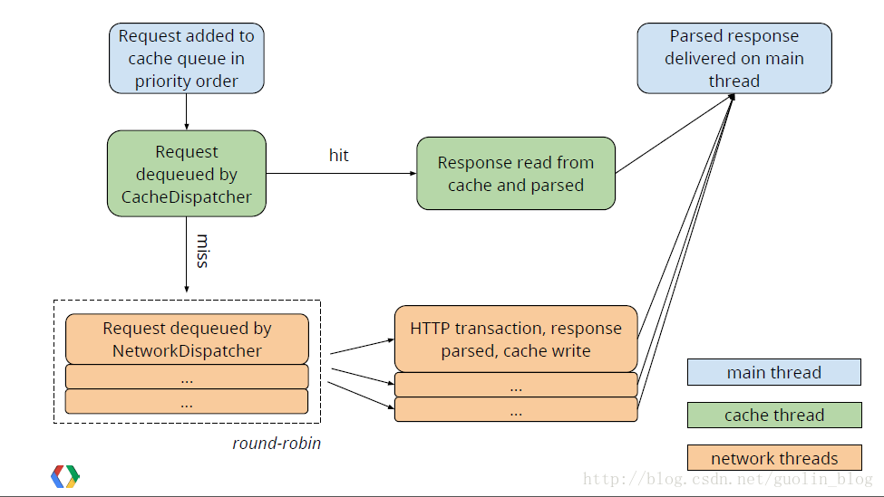

# 开始
有段时间没看源码(主要是最近有点忙)，最近公司项目也进入了改BUG阶段，终于有时间看看源码了。于是就选择来看看 `Volley` 的源码。

`Volley` 这个框架我是在刚工作那会就接触到了。那个时候除了 `HttpURLConnection` 和 `HttpClient` 以外，就只知道 `Volley` 这个网络框架。当初只是停留在用的层次，对其中的原理也是半知半解。这次就来好好看看 Volley 的源码 ~

<!-- more -->

# 基本使用

``` java

Volley.newRequestQueue(this).add(new StringRequest("",this,this));

@Override
public void onErrorResponse(VolleyError error) {
    //错误回调
}

@Override
public void onResponse(String response) {
    //成功回调
}

```

首先使用 newRequestQueue 方法。顾名思义，是创建一个请求队列。然后在调用 add 方法。将 `Request` 加入队列中。然后我们就上面都不用管。`Volley` 会自动从请求队列中取出请求执行然后回调。

需要注意的是这里的 onErrorResponse 方法和 onResponse 方法是在 UI 线程中调用的，也就是说，可以在里面直接更新 UI 。

这里我们使用的是 `StringRequest` 所以返回的也是 String 类型。除了 `StringRequest` 还有 `JsonObjectRequest` 和 `JsonArrayRequest` 这两个请求类。在这两个类中，Volley 帮我们把服务器返回的数据 转换成 `JSONObject` or `JSONArray` 。

我们也可以实现自己的 `Request`。

``` java

public class GSONRequest<T> extends Request<T> {

    private Response.Listener<T> mListener;

    private Gson mGson;

    private Class<T> mClass;

    public GSONRequest(int method, String url, Class<T> clazz, Response.Listener<T> listener, Response.ErrorListener errorListener) {
        super(method, url, errorListener);
        mGson = new Gson();
        mClass = clazz;
        mListener = listener;
    }


    @Override
    protected Response<T> parseNetworkResponse(NetworkResponse response) {
        try {
            String jsonString = new String(response.data,
                    HttpHeaderParser.parseCharset(response.headers));
            return Response.success(mGson.fromJson(jsonString, mClass),
                    HttpHeaderParser.parseCacheHeaders(response));
        } catch (UnsupportedEncodingException e) {
            return Response.error(new ParseError(e));
        }
    }

    @Override
    protected void deliverResponse(T response) {
        mListener.onResponse(response);
    }
}

```

上面我自定义了一个 `GsonRequset` 是用 `Gson` 帮我们自动把 json 字符串转换成 java 对象。

自定义 `Request` 只需要实现 parseNetWorkResponse 和 deliverResponse 这两个方法。 前者是用来讲服务器返回的数据 NetworResponse 对象转换成 `Response` 对象，这里可以使用 `Volley` 提供的 Response.success 和 Response.error 来构建成功和失败的 `Response` 对象。后者仅仅只用调用 `Listener` 中的 onResponse 方法。

## post 请求

``` java

Volley.newRequestQueue(this).add(new StringRequest(Request.Method.POST,"",this,this){
    @Override
    protected Map<String, String> getParams() throws AuthFailureError {

        HashMap<String,String> params = new HashMap<>();
        params.put("key","value");
        return params;

    }
});

```

如果需要发起 POST 请求，那么参数就需要放在 HTTP 请求体里面，这个时候就需要重新 getParams 方法，里面返回一个 HashMap 对应请求参数里面的参数名和参数值。

# 请求队列

在上面我们使用到列一个叫做 newRequestQueue 的方法，通过这个方法的名字，可以推断出这个方法创建的是一个 `请求队列` 。

队列是是一种先进先出的数据结构，把请求一个一个放入队列，然后按照进入队列的顺序一个一个的执行，这里的执行就是 `Volley` 帮我们做的事情 ，我们只需要添加请求就可以了。下面我们从 newRequestQueue 这个方法作为起点，来看看这个请求队列的具体实现。

``` java

public static RequestQueue newRequestQueue(Context context, HttpStack stack) {
    File cacheDir = new File(context.getCacheDir(), DEFAULT_CACHE_DIR);

    String userAgent = "volley/0";
    try {
        String packageName = context.getPackageName();
        PackageInfo info = context.getPackageManager().getPackageInfo(packageName, 0);
        userAgent = packageName + "/" + info.versionCode;
    } catch (NameNotFoundException e) {
    }

    if (stack == null) {
        if (Build.VERSION.SDK_INT >= 9) {
            stack = new HurlStack();
        } else {
            // Prior to Gingerbread, HttpUrlConnection was unreliable.
            // See: http://android-developers.blogspot.com/2011/09/androids-http-clients.html
            stack = new HttpClientStack(AndroidHttpClient.newInstance(userAgent));
        }
    }

    Network network = new BasicNetwork(stack);

    RequestQueue queue = new RequestQueue(new DiskBasedCache(cacheDir), network);
    queue.start();

    return queue;
}

```

在 newRequestQueue 方中先穿件 cacheDir ，顾名思义就是缓存目录，然后下面根据 SDK 版本判断使用的 HttpStack 的具体实例(多态)， 然后 new 了一个 RequestQueue 调用 start 方法之后 将 RequestQueue 返回。

## HttpUrlConnection vs HttpClient

需要注意的是这里提到了一个关于 `HttpUrlConnection` 的 bug，详情可以看 Android 的官方文档 https://developer.android.com/reference/java/net/HttpURLConnection.html ，这个bug 只出现在 Android2.2之前(包括2.2)，所以这里在2.2之前使用的是 `HttpClient`实现的网络请求即 `HttpClientStack` ，在2.2以上就使用 `HttpUrlConnection` 即 `hurlStack`。

``` java

public void start() {
    stop();  // Make sure any currently running dispatchers are stopped.
    // Create the cache dispatcher and start it.
    mCacheDispatcher = new CacheDispatcher(mCacheQueue, mNetworkQueue, mCache, mDelivery);
    mCacheDispatcher.start();

    // Create network dispatchers (and corresponding threads) up to the pool size.
    for (int i = 0; i < mDispatchers.length; i++) {
        NetworkDispatcher networkDispatcher = new NetworkDispatcher(mNetworkQueue, mNetwork,
                mCache, mDelivery);
        mDispatchers[i] = networkDispatcher;
        networkDispatcher.start();
    }
}

```

在 new RequestQueue只后又调用了 start方法。 这个方法中 创建了一个 `CacheDispatcher` 和四个 `NetworkDispatcher`，
并调用了 start 方法。跟进去看其实 CacheDispatcher 和 NetworkDispatcher 都是继承至 Thread 的。这就说明了在 start 方之后就会有 5 个线程被启动了。

调用完 newRequestQueue 方法之后，会调用add方法.

```java
public <T> Request<T> add(Request<T> request) {
    // Tag the request as belonging to this queue and add it to the set of current requests.
    request.setRequestQueue(this);
    synchronized (mCurrentRequests) {
        mCurrentRequests.add(request);
    }

    // Process requests in the order they are added.
    request.setSequence(getSequenceNumber());
    request.addMarker("add-to-queue");

    // If the request is uncacheable, skip the cache queue and go straight to the network.
    if (!request.shouldCache()) {
        mNetworkQueue.add(request);
        return request;
    }

    // Insert request into stage if there's already a request with the same cache key in flight.
    synchronized (mWaitingRequests) {
        String cacheKey = request.getCacheKey();
        if (mWaitingRequests.containsKey(cacheKey)) {
            // There is already a request in flight. Queue up.
            Queue<Request<?>> stagedRequests = mWaitingRequests.get(cacheKey);
            if (stagedRequests == null) {
                stagedRequests = new LinkedList<Request<?>>();
            }
            stagedRequests.add(request);
            mWaitingRequests.put(cacheKey, stagedRequests);
            if (VolleyLog.DEBUG) {
                VolleyLog.v("Request for cacheKey=%s is in flight, putting on hold.", cacheKey);
            }
        } else {
            // Insert 'null' queue for this cacheKey, indicating there is now a request in
            // flight.
            mWaitingRequests.put(cacheKey, null);
            mCacheQueue.add(request);
        }
        return request;
    }
}
```


在第13行代码会判断这个请求是否需要缓存，如果不需要，则直接添加到 mNetworkQueue 中。默认每个请求是需要缓存的，所以会继续往下执行。

在第21行代码会判断 mWaitingRequests 中是否有，默认这里肯定是没有的，所以会执行 else 中的代码。
在 else 中会把 requset 的 cacheKey 添加到 mWaitingRequests 中，但 value 是 null。然后会将 request 添加到 mCacheQueue 中。

这里我们可以假设一下，如果我们重复执行两个请求(调用add方法，两个相同 cacheKey 的 Reques t )，第一个请求会执行 else 里面的逻辑，那么第二请求就会 走 if 里面的逻辑，里面会从 mWaitingRequests 获取出一个 `Queue` 对象，这里肯定是 null 然后就会 new 一个 `LinkedList` ,并把 request 添加到这个 `LinkedList` 中，最后在把 `LinkedList` 添加到 mWaitingRequests 中。

至于这个 mWaitingRequests 是干嘛用的，我们后面慢慢分析。

执行完 add 方法之后，Request 对象已经被添加到 mCacheQueue 中。这里要讲到之前在 newRequestQueue 方法中启动的 CacheDispatcher 线程了。

CacheDisPatcher.java

``` java
@Override
public void run() {
    if (DEBUG) VolleyLog.v("start new dispatcher");
    Process.setThreadPriority(Process.THREAD_PRIORITY_BACKGROUND);

    // Make a blocking call to initialize the cache.
    mCache.initialize();

    while (true) {
        try {
            // Get a request from the cache triage queue, blocking until
            // at least one is available.
            final Request<?> request = mCacheQueue.take();
            request.addMarker("cache-queue-take");

            // If the request has been canceled, don't bother dispatching it.
            if (request.isCanceled()) {
                request.finish("cache-discard-canceled");
                continue;
            }

            // Attempt to retrieve this item from cache.
            Cache.Entry entry = mCache.get(request.getCacheKey());
            if (entry == null) {
                request.addMarker("cache-miss");
                // Cache miss; send off to the network dispatcher.
                mNetworkQueue.put(request);
                continue;
            }

            // If it is completely expired, just send it to the network.
            if (entry.isExpired()) {
                request.addMarker("cache-hit-expired");
                request.setCacheEntry(entry);
                mNetworkQueue.put(request);
                continue;
            }

            // We have a cache hit; parse its data for delivery back to the request.
            request.addMarker("cache-hit");
            Response<?> response = request.parseNetworkResponse(
                    new NetworkResponse(entry.data, entry.responseHeaders));
            request.addMarker("cache-hit-parsed");

            if (!entry.refreshNeeded()) {
                // Completely unexpired cache hit. Just deliver the response.
                mDelivery.postResponse(request, response);
            } else {
                // Soft-expired cache hit. We can deliver the cached response,
                // but we need to also send the request to the network for
                // refreshing.
                request.addMarker("cache-hit-refresh-needed");
                request.setCacheEntry(entry);

                // Mark the response as intermediate.
                response.intermediate = true;

                // Post the intermediate response back to the user and have
                // the delivery then forward the request along to the network.
                mDelivery.postResponse(request, response, new Runnable() {
                    @Override
                    public void run() {
                        try {
                            mNetworkQueue.put(request);
                        } catch (InterruptedException e) {
                            // Not much we can do about this.
                        }
                    }
                });
            }

        } catch (InterruptedException e) {
            // We may have been interrupted because it was time to quit.
            if (mQuit) {
                return;
            }
            continue;
        }
    }
}
```

首先要知道，这里的 mCacheQueue 就是 `RequestQueue` 中的 mCacheQueue，刚刚我们已经把 请求添加到这个 `Queue` 中了。
那么在 `CacheDispatcher` 的 run 方法中首先从 mRequestQueue 中取出 `Request` 对象，先从 mCache 中获取，如果获取不到，就会把这个 `Request` 对象添加到 mNetworkQueue 中，如果获取到了，就判断请求是否失效，如果失效也添加到 mNetworQueue 中，反之使用 mDelivery 进行回调。

那么默认第一次执行一个请求，肯定是没有缓存的。就会被添加 mNetworkQueue 中，对应的处理线程是 `NetworkDispatcher` 中。

NetworkDispatcher.java

``` java

@Override
public void run() {
    Process.setThreadPriority(Process.THREAD_PRIORITY_BACKGROUND);
    while (true) {
        long startTimeMs = SystemClock.elapsedRealtime();
        Request<?> request;
        try {
            // Take a request from the queue.
            request = mQueue.take();
        } catch (InterruptedException e) {
            // We may have been interrupted because it was time to quit.
            if (mQuit) {
                return;
            }
            continue;
        }

        try {
            request.addMarker("network-queue-take");

            // If the request was cancelled already, do not perform the
            // network request.
            if (request.isCanceled()) {
                request.finish("network-discard-cancelled");
                continue;
            }

            addTrafficStatsTag(request);

            // Perform the network request.
            NetworkResponse networkResponse = mNetwork.performRequest(request);
            request.addMarker("network-http-complete");

            // If the server returned 304 AND we delivered a response already,
            // we're done -- don't deliver a second identical response.
            if (networkResponse.notModified && request.hasHadResponseDelivered()) {
                request.finish("not-modified");
                continue;
            }

            // Parse the response here on the worker thread.
            Response<?> response = request.parseNetworkResponse(networkResponse);
            request.addMarker("network-parse-complete");

            // Write to cache if applicable.
            // TODO: Only update cache metadata instead of entire record for 304s.
            if (request.shouldCache() && response.cacheEntry != null) {
                mCache.put(request.getCacheKey(), response.cacheEntry);
                request.addMarker("network-cache-written");
            }

            // Post the response back.
            request.markDelivered();
            mDelivery.postResponse(request, response);
        } catch (VolleyError volleyError) {
            volleyError.setNetworkTimeMs(SystemClock.elapsedRealtime() - startTimeMs);
            parseAndDeliverNetworkError(request, volleyError);
        } catch (Exception e) {
            VolleyLog.e(e, "Unhandled exception %s", e.toString());
            VolleyError volleyError = new VolleyError(e);
            volleyError.setNetworkTimeMs(SystemClock.elapsedRealtime() - startTimeMs);
            mDelivery.postError(request, volleyError);
        }
    }
}

```

`NetworkDispatcher` 中的逻辑和 `CacheDispatcher` 很相似，首先会调用 mNetwork 的 performRequest 方法，这个方法中是执行网络请求，然后返回一个 `NetworkResponse` 对象。这个对象和 `Response` 对象还是有区别的，因为我们在请求数据的时候 只关心服务器返回的数据，至于一些 HTTP 里面的信息并不关心，所以这里 `Volley` 提供了 `Response` 接口来将不需要的数据剔除。在然后会调用 request 的 parseNetworkResponse ，这个方法很熟悉。我们上面实现自定义的 `Request` 的时候是必须要实现这个类的，这类的作用就是将 `NetworkResponse` 转换成 `Response` 具体的转换方式有具体实现来决定。

解析转换完数据之后，就会调用 mCache 的 put 方法将请求缓存起来。最后就使用 mDelivery 来处理回调。


# 请求缓存

在前面 RequestQueue 的 add 方法中，有一个 mWaitingRequests，当我们add一个已经被add过的Request(连个cacheKey一样的Request)，他就会把Request 添加到 mWaitingRequests 中。这些上面都已经分析了的。但是添加完之后就没有有然后了。那么问题来了？Volley是怎么把 mWaitingRequest 中的 Request 执行的呢？

RequestQuque.java

``` java

<T> void finish(Request<T> request) {
    // Remove from the set of requests currently being processed.
    synchronized (mCurrentRequests) {
        mCurrentRequests.remove(request);
    }
    synchronized (mFinishedListeners) {
      for (RequestFinishedListener<T> listener : mFinishedListeners) {
        listener.onRequestFinished(request);
      }
    }

    if (request.shouldCache()) {
        synchronized (mWaitingRequests) {
            String cacheKey = request.getCacheKey();
            Queue<Request<?>> waitingRequests = mWaitingRequests.remove(cacheKey);
            if (waitingRequests != null) {
                if (VolleyLog.DEBUG) {
                    VolleyLog.v("Releasing %d waiting requests for cacheKey=%s.",
                            waitingRequests.size(), cacheKey);
                }
                // Process all queued up requests. They won't be considered as in flight, but
                // that's not a problem as the cache has been primed by 'request'.
                mCacheQueue.addAll(waitingRequests);
            }
        }
    }
}

```

在 RequestQueue 这类中除了 add 方法中用到 mWaitingRequest 另外一个用到地方就是 finish 方法，这个方法中首先会 会把请求从 mCurrentRequests 中移除，然后循环调用 RequestFinishedListener 中的 onRequestFinished。

最后判断是否需要缓存，如果需要缓冲就把 Request 从 mWaitingRequests 中移除，并添加到 mCacheQueue中。但是这里有一个问题，这个finish方法并没有在RequestQueue中被调用，仔细观察 CacheDispatcher 和 NetworkDispatcher 这样类的 run 方法，都调用过 request 的 finish 方法。而在Request的finish 会调用 RequestQueue 的finsih犯法。

CacheDispatcher 是在被取消的时候会调用 finsih 方法。NetworDispatcher 中是在请求返回码为 304 的时候才会调用 finish方法。那这个时候如果服务器没有处理重复请求的问题(没有返回304)，那岂不是无法让请求进入mCacheQueue中?


# 处理响应

finsih 方法一定还在别的地方被调用，不然逻辑上走不通(请求既不会添加到 mCacheQueue 中也不会添加到 mNetworkQueue 中)。还记不记得上面分析 add 方法的时候，无论是 `NetworDispatcher` 还是 `CacheDispathcer` 在最后都是通过 mDelivery.postResponse 方法来进行回调的.下面看看这个类中有没有调用 finish 。

ExecutorDelivery.java

``` java

public class ExecutorDelivery implements ResponseDelivery {
    /** Used for posting responses, typically to the main thread. */
    private final Executor mResponsePoster;

    /**
     * Creates a new response delivery interface.
     * @param handler {@link Handler} to post responses on
     */
    public ExecutorDelivery(final Handler handler) {
        // Make an Executor that just wraps the handler.
        mResponsePoster = new Executor() {
            @Override
            public void execute(Runnable command) {
                handler.post(command);
            }
        };
    }

    /**
     * Creates a new response delivery interface, mockable version
     * for testing.
     * @param executor For running delivery tasks
     */
    public ExecutorDelivery(Executor executor) {
        mResponsePoster = executor;
    }

    @Override
    public void postResponse(Request<?> request, Response<?> response) {
        postResponse(request, response, null);
    }

    @Override
    public void postResponse(Request<?> request, Response<?> response, Runnable runnable) {
        request.markDelivered();
        request.addMarker("post-response");
        mResponsePoster.execute(new ResponseDeliveryRunnable(request, response, runnable));
    }

    @Override
    public void postError(Request<?> request, VolleyError error) {
        request.addMarker("post-error");
        Response<?> response = Response.error(error);
        mResponsePoster.execute(new ResponseDeliveryRunnable(request, response, null));
    }

    /**
     * A Runnable used for delivering network responses to a listener on the
     * main thread.
     */
    @SuppressWarnings("rawtypes")
    private class ResponseDeliveryRunnable implements Runnable {
        private final Request mRequest;
        private final Response mResponse;
        private final Runnable mRunnable;

        public ResponseDeliveryRunnable(Request request, Response response, Runnable runnable) {
            mRequest = request;
            mResponse = response;
            mRunnable = runnable;
        }

        @SuppressWarnings("unchecked")
        @Override
        public void run() {
            // If this request has canceled, finish it and don't deliver.
            if (mRequest.isCanceled()) {
                mRequest.finish("canceled-at-delivery");
                return;
            }

            // Deliver a normal response or error, depending.
            if (mResponse.isSuccess()) {
                mRequest.deliverResponse(mResponse.result);
            } else {
                mRequest.deliverError(mResponse.error);
            }

            // If this is an intermediate response, add a marker, otherwise we're done
            // and the request can be finished.
            if (mResponse.intermediate) {
                mRequest.addMarker("intermediate-response");
            } else {
                mRequest.finish("done");
            }

            // If we have been provided a post-delivery runnable, run it.
            if (mRunnable != null) {
                mRunnable.run();
            }
       }
    }
}

```

可以看到调用 postResponse 方法之后，最终会调用 mResponsePoster的execute 方法，在 execute 方法中会调用 handler 的 post 方法。

这里就实现线程的切换，要知道上面的CacheDispatcher和NetWorkDispatcher都是在子线程，如果在里面直接回调的话，我在外面使用回调的时候还要使用一个Handler来更新UI，所以Volley帮我们实现了UI线程的回调。回到上个问题，finish 方法在 `ResponseDeliveryRunnable` 的 run 方法中的调用，这就实现了把 mWaitingRequests 中的请求 放入 mCacheQueue 的操作。

我们可以想一下，为什么 `Volley` 要这么设计，非要弄一个 mWaitingRequests 。我认为之所以这么设计是因为我们在执行两个相同的请求的时候，可能网速比较慢，第一个请求还没执行完(执行完会加入缓存)，按理说第二请求应该是可以服用第一个请求的。但是如果没有加入缓存就无法复用，所以这里加入一个 mWaitingRequests 让第二请求放在里面，等第一个请求执行完(加入缓存中)，在调用 finsih 将 mWaitingRequest 中请求加入 mCacheQueue 从而达到缓存的功能(降低重复请求一个接口所消耗的网络资源)。

# 总结

上一张Volley的工作流程图。



通过上面的源码分析，很容易就看懂这张图。Volley 中一共有3种类型线程。

1. `ManThread` Android中的UI线程 默认一个
2. `CacheThread` 缓存队列的执行线程 默认一个
3. `NetworkThread` 网络请求队列的执行线程 默认四个

这3种线程互相配合工作，可以大大提高网络请求的速度，这也应征了 `Volley` 这个单词的本意(并发)。
