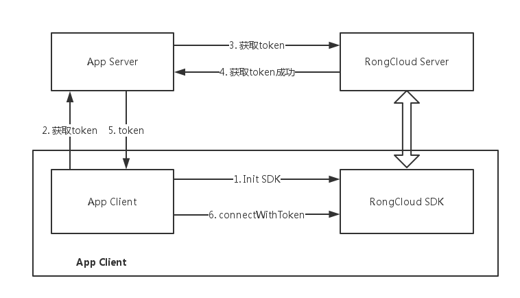
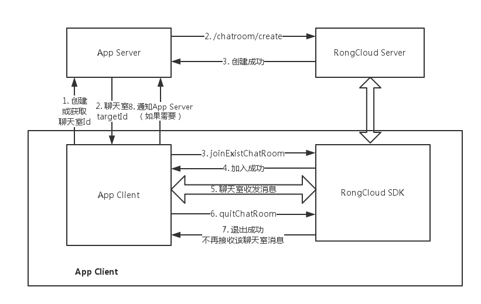
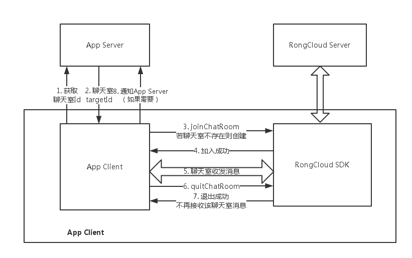

# 开始
最近公司准备基于融云 + 七牛云直播，做一个关于直播类型的 APP ，所以提前熟悉下融云的 SDK 对开发还是有很大的好处的。

<!-- more -->

# 下载Demo
官方 Demo 下载地址:https://github.com/rongcloud/demo-app-imlib-live-chatroom-android

整个项目分为两个Module，一个APP 一个 imlib，其中imlib其实只包含了一些关于融云的 jar 包和 so 库，APP 中包含了一个可以查看别人直播并可以聊天的一个小 Demo。

# 融云聊天室的执行流程
首先先来了解一下融云IM SDK 的工作方式:



>从上图中我们得出，我们要链接融云的SDK，大概分为一下这几个步骤.

>1. 获取 Token，这个 Token 可以在客户端，也可以在服务器获取，融云官方推荐是在服务器获取。因为关于 Token 的获取需要用到 AppSecret，这个 AppSecret 是一个比较私密的东西，如果被人反编译看到了就会被别人干一些不好的事情。所以这里最好的做法就是我们调用服务的接口，服务器在去调用融云获取 Token 然后返回给客户端。

>2. 获取 Token 之后就可以拿这个Token去链接融云的SDK，后面就可以愉快的玩耍了。

## 加入聊天室





> 链接融云SDK成功之后，就可以调用融云的SDK中的进入聊天室的接口。

>1. 请求我们的服务器，获取聊天室ID，服务器返回 TargetId 。这里分为两种情况，第一种情况是由我们的服务器来管理聊天室，客户端只能进入已经存在的聊天室，第二种情况是客户端来创建聊天室，客户端调用加入聊天室的方法，如果该聊天室存在就加入，如果不存在就加入。

>2. 加入聊天室成之后就可以开心的发消息了，如果用户退出界面就调用退出聊天室的接口。

聊天室的大概流程就是上面，下面我分析下 Demo 中代码的具体时间逻辑

# Demo 代码

App.java

``` java

package cn.rongcloud.live;

import android.app.Application;
import android.content.Context;

import cn.rongcloud.live.fakeserver.FakeServer;

public class App extends Application {

    private static Context context;

    @Override
    public void onCreate() {
        super.onCreate();
        context = this;
        //在 Application 的 onCreate 方法中初始化 SDK
        LiveKit.init(context, FakeServer.getAppKey());
    }

    public static Context getContext() {
        return context;
    }
}

```

LoginActivity.java

``` java

    //登录方法 传入用户名 与 密码 url 是直播的拉流地址 大概如下:
    //rtmp://vlive3.rtmp.cdn.ucloud.com.cn/ucloud/8971
    private void fakeLogin(String id, String password, final String url) {
        //这里的UserInfo 是融云提供的类，主要由 id ，name ，和头像 uri 构成。
        final UserInfo user = FakeServer.getLoginUser(id, password);
        //获取 Token 这里的逻辑是自己写的，按照上面的流程，这里调用自己服务的获取 Token 的接口。
        FakeServer.getToken(user, new HttpUtil.OnResponse() {
            @Override
            public void onResponse(int code, String body) {
                if (code != 200) {
                    //Token 获取失败
                    Toast.makeText(LoginActivity.this, body, Toast.LENGTH_SHORT).show();
                    return;
                }

                String token;
                try {
                    JSONObject jsonObj = new JSONObject(body);
                    token = jsonObj.getString("token");
                } catch (JSONException e) {
                    e.printStackTrace();
                    Toast.makeText(LoginActivity.this, "Token 解析失败!", Toast.LENGTH_SHORT).show();
                    return;
                }

                //连接融云 SDK
                LiveKit.connect(token, new RongIMClient.ConnectCallback() {
                    @Override
                    public void onTokenIncorrect() {
                        RcLog.d(TAG, "connect onTokenIncorrect");
                        // 检查appKey 与token是否匹配.
                    }

                    @Override
                    public void onSuccess(String userId) {
                        RcLog.d(TAG, "connect onSuccess");
                        //设置当前的User
                        LiveKit.setCurrentUser(user);
                        Intent intent = new Intent(LoginActivity.this, LiveShowActivity.class);
                        intent.putExtra(LiveShowActivity.LIVE_URL, url);
                        startActivity(intent);
                    }

                    @Override
                    public void onError(RongIMClient.ErrorCode errorCode) {
                        RcLog.d(TAG, "connect onError = " + errorCode);
                        // 根据errorCode 检查原因.
                    }
                });
            }
        });
    }

```


LiveShowActivity.java

``` java

    // onCreate 方法。
    @Override
    protected void onCreate(Bundle savedInstanceState) {
        super.onCreate(savedInstanceState);
        setContentView(R.layout.activity_liveshow);
        //将LiveShowActivity 与 LiveKit 绑定 类似 观察者模式，是使用Handler接收的消息。
        LiveKit.addEventHandler(handler);
        initView();
        startLiveShow();
    }

    // 加入聊天室并显示直播
    private void startLiveShow() {
        //房间Id
        roomId = "ChatRoom01";
//        String liveUrl = "rtmp://live.hkstv.hk.lxdns.com/live/hks";
        //拉流地址
        String liveUrl = getIntent().getStringExtra(LiveShowActivity.LIVE_URL);
        //加入聊天室
        joinChatRoom(roomId);
        playShow(liveUrl);
    }

    //加入聊天室
    private void joinChatRoom(final String roomId) {
        //加入聊天室，聊天室Id 默认显示多少条历史消息 回调
        LiveKit.joinChatRoom(roomId, 2, new RongIMClient.OperationCallback() {
            @Override
            public void onSuccess() {
                final InformationNotificationMessage content = InformationNotificationMessage.obtain("来啦");
                LiveKit.sendMessage(content);
            }

            @Override
            public void onError(RongIMClient.ErrorCode errorCode) {
                Toast.makeText(LiveShowActivity.this, "聊天室加入失败! errorCode = " + errorCode, Toast.LENGTH_SHORT).show();
            }
        });
    }

```

加入聊天室的代码大概就上面那么多，具体的实现逻辑在 LiveKit.java 中，具体代码如下：

LiveKit.java

``` java

    //LiveKit 初始化方法，推荐在 Application 的 onCreate 中调用。
    public static void init(Context context, String appKey) {
        RongIMClient.init(context, appKey);
        EmojiManager.init(context);

        //注册消息接收监听者
        RongIMClient.setOnReceiveMessageListener(onReceiveMessageListener);

        //注册消息类型
        registerMessageType(GiftMessage.class);
        //注册 消息类型/View 的关系，用于在展示消息的界面展示不同的消息。
        registerMessageView(TextMessage.class, TextMsgView.class);
        registerMessageView(InformationNotificationMessage.class, InfoMsgView.class);
        registerMessageView(GiftMessage.class, GiftMsgView.class);
    }

    //接收事件
    private static RongIMClient.OnReceiveMessageListener onReceiveMessageListener = new RongIMClient.OnReceiveMessageListener() {
        @Override
        public boolean onReceived(Message message, int i) {
            handleEvent(MESSAGE_ARRIVED, message.getContent());
            return false;
        }
    };

    //聊天室发送消息
    public static void sendMessage(final MessageContent msgContent) {
        if (currentUser == null) {
            throw new RuntimeException("currentUser should not be null.");
        }

        msgContent.setUserInfo(currentUser);
        Message msg = Message.obtain(currentRoomId, Conversation.ConversationType.CHATROOM, msgContent);
        //调用融云 SDK 中发消息方法，在回调中通知所有 Handler 进行处理。
        RongIMClient.getInstance().sendMessage(msg, null, null, new RongIMClient.SendMessageCallback() {
            @Override
            public void onSuccess(Integer integer) {
                handleEvent(MESSAGE_SENT, msgContent);
            }

            @Override
            public void onError(Integer integer, RongIMClient.ErrorCode errorCode) {
                handleEvent(MESSAGE_SEND_ERROR, errorCode.getValue(), 0, msgContent);
            }
        }, new RongIMClient.ResultCallback<Message>() {
            @Override
            public void onSuccess(Message message) {
            }

            @Override
            public void onError(RongIMClient.ErrorCode e) {
            }
        });
    }

```

比较重要的方法大概就上面几个，其他的方法都是对融云的代码进行包装，比如登出，退出聊天室等。下面看看关于不同消息 是怎么在界面中展示的。


``` java

// GiftMsgView.java 礼物类型的消息的展示实现
public class GiftMsgView extends BaseMsgView {

    private TextView username;
    private TextView content;

    public GiftMsgView(Context context) {
        super(context);
        View view = LayoutInflater.from(getContext()).inflate(R.layout.msg_gift_view, this);
        username = (TextView) view.findViewById(R.id.username);
        content = (TextView) view.findViewById(R.id.content);
    }

    @Override
    public void setContent(MessageContent msgContent) {
        GiftMessage msg = (GiftMessage) msgContent;
        username.setText(msg.getUserInfo().getName() + " ");
        content.setText(EmojiManager.parse(msg.getContent(), content.getTextSize()));
    }
}

//TextmsgView.java 普通消息View 在这里主要是实现普通的弹幕显示
public class TextMsgView extends BaseMsgView {

    private TextView username;
    private TextView msgText;

    public TextMsgView(Context context) {
        super(context);
        View view = LayoutInflater.from(getContext()).inflate(R.layout.msg_text_view, this);
        username = (TextView) view.findViewById(R.id.username);
        msgText = (TextView) view.findViewById(R.id.msg_text);
    }

    @Override
    public void setContent(MessageContent msgContent) {
        TextMessage msg = (TextMessage) msgContent;
        username.setText(msg.getUserInfo().getName() + ": ");
        msgText.setText(EmojiManager.parse(msg.getContent(), msgText.getTextSize()));
    }
}

//InfoMsgView.java 信息消息展示的实现，在这里主要实现进入聊天室的消息提醒。
public class InfoMsgView extends BaseMsgView {

    private TextView username;
    private TextView infoText;

    public InfoMsgView(Context context) {
        super(context);
        View view = LayoutInflater.from(getContext()).inflate(R.layout.msg_info_view, this);
        username = (TextView) view.findViewById(R.id.username);
        infoText = (TextView) view.findViewById(R.id.info_text);
    }

    @Override
    public void setContent(MessageContent msgContent) {
        InformationNotificationMessage msg = (InformationNotificationMessage) msgContent;
        username.setText(msg.getUserInfo().getName() + " ");
        infoText.setText(msg.getMessage());
    }
}

    //LiveShowActivity.java 处理服务融云的消息通知适配器更新
    public boolean handleMessage(android.os.Message msg) {
        switch (msg.what) {
            //处理接收到的消息
            case LiveKit.MESSAGE_ARRIVED: {
                MessageContent content = (MessageContent) msg.obj;
                chatListAdapter.addMessage(content);
                break;
            }
            //处理发送的消息
            case LiveKit.MESSAGE_SENT: {
                MessageContent content = (MessageContent) msg.obj;
                chatListAdapter.addMessage(content);
                break;
            }
            case LiveKit.MESSAGE_SEND_ERROR: {
                break;
            }
            default:
        }
        chatListAdapter.notifyDataSetChanged();
        return false;
    }

```

# 总结
上面差不多就是聊天室的大部分实现，没什么特别难的地方。主要需要注意的地方就是之定义的消息类型和之定义消息的展示逻辑这块。